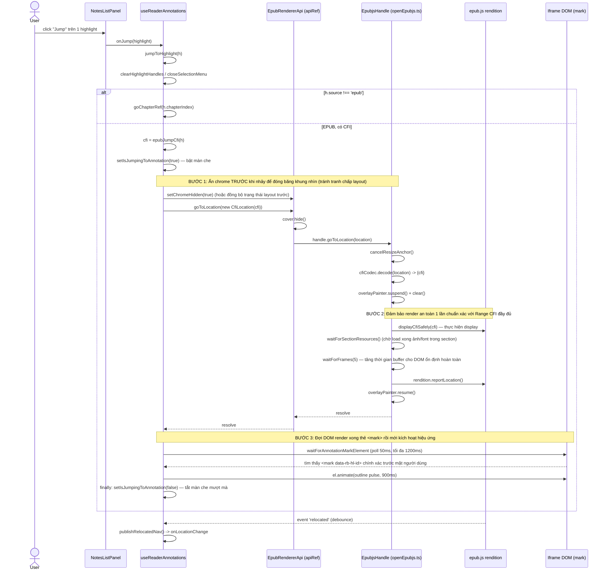
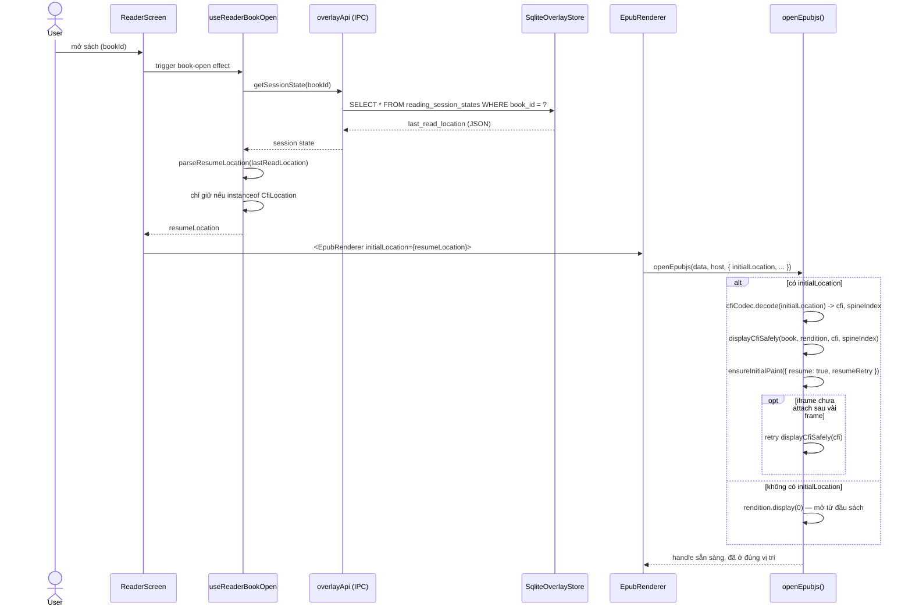

# Jump to Location — cách hoạt động

Tài liệu này mô tả cơ chế "nhảy tới một vị trí" (jump to location) trong app đọc sách desktop:
nhảy tới highlight/annotation, bookmark, ghi chú typewriter, và việc resume đúng vị trí đọc dở
khi mở lại sách. Phạm vi chính là EPUB (định dạng duy nhất hiện có cơ chế nhảy chính xác bằng CFI).

## 1. Các điểm gọi "jump" trong app

Tất cả nằm trong
[useReaderAnnotations.ts](source/apps/reading-book-desktop/src/screens/Reader/logic/hooks/useReaderAnnotations.ts):

| Nơi gọi | Hàm | Kích hoạt từ |
|---|---|---|
| Nhảy tới highlight | `jumpToHighlight(h)` | `NotesListPanel` → `onJump` → `ReaderScreen.tsx` `onJumpHighlight` |
| Nhảy tới bookmark | `jumpToBookmark(bookmark)` | `TocSidebar` (tab bookmark) → `onJumpBookmark` |
| Nhảy tới ghi chú typewriter | `jumpToTypewriterNote(note)` | `NotesListPanel` → `onJumpTypewriterNote` |
| Nhảy tới nét vẽ tay (pencil) | `jumpToFreehandStroke(stroke)` | `NotesListPanel` → `onJumpPencilStroke` |
| Resume đúng vị trí đọc dở | `initialLocation` prop của `EpubRenderer` | Khi mở sách (`book.resumeLocation`) |
| Nhảy theo mục lục | `handleSelectTocItem(item)` → `api.goToHref(item.href)` | `TocSidebar` (cây chương) |

Có 2 kiểu nhảy:

- **Nhảy chính xác bằng CFI** (chỉ EPUB): `jumpToHighlight`, `jumpToBookmark` (khi `Location` là
  `CfiLocation`), `jumpToTypewriterNote` (khi note có CFI) — dùng
  `epubApiRef.current.goToLocation(new CfiLocation(cfi))`.
- **Nhảy thô theo chương/trang**: dùng cho nội dung không phải EPUB ("fake chapter") hoặc khi
  không có CFI — gọi thẳng `goChapterRef.current(chapterIndex)` / `goToPageRef.current(page)`,
  không có polling/flash. `jumpToFreehandStroke` luôn dùng đường này vì nét vẽ tay hiện chỉ gắn
  theo số trang.

Tính năng "nhảy tới kết quả tìm kiếm" **chưa tồn tại** — nút Search trên toolbar hiện chỉ hiện
toast "coming soon".

### Sequence diagram — nhảy tới highlight (CFI)



## 2. Domain model `Location` và port `LocationCodec`

`Location` — [packages/domain/models/reading/location.ts](source/packages/domain/models/reading/location.ts) —
là một abstract value object, phân biệt bằng field `kind`, có 3 subclass:

- `CfiLocation` (`kind: 'cfi'`) — bọc một `cfi: string` (EPUB Canonical Fragment Identifier).
- `PageRectLocation` (`kind: 'page-rect'`) — `page` (1-based) + `Rect` tuỳ chọn, dùng cho PDF.
- `TextOffsetLocation` (`kind: 'text-offset'`) — `offset` + `blockId` tuỳ chọn, dùng cho định
  dạng văn bản thuần, và cũng bị tận dụng làm placeholder cho các màn "fake chapter" (chưa có
  renderer thật) qua `blockId = 'fake:${chapterIndex}'`.

Mỗi subclass có `toString()` (serialize ra JSON — đây là dạng lưu trữ chuẩn, ví dụ trong
`bookmarks.location_ref` hay `reading_session_states.last_read_location`), `equals()`, và static
`fromPlain()`. `Location.parse(raw)` là điểm deserialize duy nhất, dispatch theo `kind`.

`LocationCodec` — [packages/domain/ports/location-codec.ts](source/packages/domain/ports/location-codec.ts) —
là port kiểu Ports & Adapters: `encode(input)` biến payload riêng của renderer engine thành
`Location` (agnostic); `decode(location)` biến `Location` ngược lại thành handle engine hiểu được.

Adapter EPUB duy nhất hiện có: `CfiCodec` —
[reader/renderers/epub/cfi/cfi-codec.ts](source/apps/reading-book-desktop/src/reader/renderers/epub/cfi/cfi-codec.ts).
`encode` nhận CFI string (hoặc payload `relocated` của epub.js) và bọc thành `CfiLocation`;
`decode` trả về `{ cfi }` — chuỗi CFI thô mà `rendition.display(cfi)` của epub.js chấp nhận.
`tryEncodeCfi` là bản không throw, dùng khi CFI có thể chưa sẵn sàng.

## 3. Luồng nhảy CFI trong EPUB — chi tiết từng bước

### 3.1 Các hằng số thời gian

Trong `useReaderAnnotations.ts`:

```ts
const ANNOTATION_JUMP_FLASH_MS = 900        // thời lượng animation "flash" viền
const ANNOTATION_JUMP_MARK_TIMEOUT_MS = 900 // tổng thời gian poll tìm DOM element trước khi bỏ cuộc
const ANNOTATION_JUMP_MARK_POLL_MS = 40     // khoảng cách giữa mỗi lần poll
```

### 3.2 Xác định CFI cần nhảy tới

- `epubJumpCfi(h)` (`packages/shared/models/highlight-persistence.ts`) — trả về
  `h.locationStart?.trim() || h.cfiRange.trim()`: ưu tiên CFI điểm-bắt-đầu thay vì CFI cả dải,
  vì `rendition.display()` cần một điểm hiển thị, không phải một range.
- `epubTypewriterJumpCfi(note)` (`packages/shared/models/typewriter-persistence.ts`) — trả về
  `note.cfi` nếu có, hoặc parse `note.positionData`; trả `undefined` nếu note không gắn CFI
  (ví dụ đặt trên trang "fake chapter").

### 3.3 `jumpToHighlight(h)`

1. Đóng mọi UI nổi đang mở (`clearHighlightHandles`, `closeSelectionMenu`, `blurReaderSidebarFocus`).
2. Nếu highlight không thuộc EPUB (`h.source !== 'epub'`): chỉ `goChapterRef.current(h.chapterIndex)`
   rồi return — không dùng CFI.
3. Tính `cfi = epubJumpCfi(h)`. Rỗng → log lỗi + toast "Không tìm thấy vị trí đánh dấu này trong sách."
4. `setIsJumpingToAnnotation(true)` — bật cờ "màn che" để giấu khoảng nhấp nháy trong lúc epub.js
   đang `display()`/reflow, khiến cú nhảy *trông* tức thời thay vì giật hình.
5. `await epubApiRef.current?.goToLocation(new CfiLocation(cfi))` — điều hướng thật (xem 3.6).
6. `setChromeHidden(true)` **chỉ sau khi** cú nhảy ổn định — cố ý đặt sau để tránh việc ẩn
   toolbar (gây resize) đua với logic scroll-tới-CFI của epub.js, có thể làm màn hình trắng ở
   chế độ scroll liên tục.
7. `await waitForFrames(2)` — chờ 2 tick `requestAnimationFrame` để trình duyệt kịp paint layout mới.
8. `flashAnnotationMark('[data-rb-hl-id="..."]')` (fire-and-forget) — nhấp nháy viền hổ phách trên
   `<mark>` của highlight (xem 3.5).
9. `finally { setIsJumpingToAnnotation(false) }` — tắt màn che.

### 3.4 `jumpToTypewriterNote(note)`

Tương tự nhưng có thêm fallback: nếu note không nằm trên bề mặt EPUB, hoặc không parse được CFI,
rơi về `goToPageRef.current(loc.page)` hoặc `goChapterRef.current(note.chapterIndex)`. Nếu có CFI
thì cùng pattern `setIsJumpingToAnnotation` → `goToLocation` → `flashAnnotationMark`, nhưng dùng
selector `[data-rb-tw-note="..."]` (khớp với attribute mà `typewriter-iframe-layer` gắn lên DOM).

### Sequence diagram — logic điều phối jump tại tầng annotations (`useReaderAnnotations.ts`)

Diagram này chỉ mô tả **logic rẽ nhánh ở tầng orchestration** (không đi sâu vào bên trong
`goToLocation`/epub.js như diagram ở mục 1) — trả lời câu hỏi "với mỗi loại annotation, app quyết
định dùng CFI hay fallback chương/trang như thế nào".

```mermaid
sequenceDiagram
    actor U as User
    participant UI as Sidebar (NotesListPanel / TocSidebar)
    participant RA as useReaderAnnotations
    participant EPUB as epubApiRef.goToLocation
    participant PAGE as goToPageRef / goChapterRef
    participant FLASH as flashAnnotationMark

    Note over RA: Chung cho cả 3 loại: đóng UI nổi trước<br/>(clearHighlightHandles / closeSelectionMenu / blurReaderSidebarFocus)

    alt Jump highlight — jumpToHighlight(h)
        U->>UI: click "Jump" trên highlight
        UI->>RA: jumpToHighlight(h)
        alt h.source !== 'epub'
            RA->>PAGE: goChapterRef(h.chapterIndex)
        else EPUB
            RA->>RA: cfi = epubJumpCfi(h) = locationStart || cfiRange
            alt cfi rỗng
                RA->>RA: toast lỗi, dừng
            else có cfi
                RA->>RA: setIsJumpingToAnnotation(true)
                RA->>EPUB: goToLocation(new CfiLocation(cfi))
                EPUB-->>RA: resolved
                RA->>RA: setChromeHidden(true); waitForFrames(2)
                RA->>FLASH: flashAnnotationMark([data-rb-hl-id])
                RA->>RA: setIsJumpingToAnnotation(false)
            end
        end
    else Jump typewriter note — jumpToTypewriterNote(note)
        U->>UI: click "Jump" trên note
        UI->>RA: jumpToTypewriterNote(note)
        RA->>RA: setChromeHidden(true)
        alt !isEpub
            alt loc.anchor === 'page-rect'
                RA->>PAGE: goToPageRef(loc.page)
            else
                RA->>PAGE: goChapterRef(note.chapterIndex)
            end
        else EPUB
            RA->>RA: cfi = epubTypewriterJumpCfi(note)
            alt cfi undefined
                RA->>PAGE: fallback goToPageRef / goChapterRef
            else có cfi
                RA->>RA: setIsJumpingToAnnotation(true)
                RA->>EPUB: goToLocation(new CfiLocation(cfi))
                EPUB-->>RA: resolved
                RA->>FLASH: flashAnnotationMark([data-rb-tw-note])
                RA->>RA: setIsJumpingToAnnotation(false)
            end
        end
    else Jump freehand stroke — jumpToFreehandStroke(stroke)
        U->>UI: click "Jump" trên nét vẽ tay
        UI->>RA: jumpToFreehandStroke(stroke)
        RA->>PAGE: goToPageRef(readerFreehandPageNumber(stroke))
        Note over RA,PAGE: Luôn theo số trang — freehand chưa có CFI,<br/>không có bước flash/poll
    end
```

Điểm khác biệt chính giữa 3 nhánh:

| Hàm | Có đường CFI? | Thời điểm `setChromeHidden(true)` | Có flash không? |
| --- | --- | --- | --- |
| `jumpToHighlight` | Có (nếu `source === 'epub'`) | Sau khi `goToLocation` resolve | Có (`[data-rb-hl-id]`) |
| `jumpToTypewriterNote` | Có, nếu note gắn CFI | Ngay đầu hàm (trước cả khi biết có CFI hay không) | Có (`[data-rb-tw-note]`) |
| `jumpToFreehandStroke` | Không — luôn theo trang | Không gọi | Không |

### 3.5 Cơ chế poll + flash (`findAnnotationMarkElement` / `waitForAnnotationMarkElement` / `flashAnnotationMark`)

- Nội dung EPUB nằm trong `<iframe>`, nên `findAnnotationMarkElement(selector)` thử
  `document.querySelector` trên host trước, sau đó duyệt từng `iframe.contentDocument`.
- `waitForAnnotationMarkElement` poll tối đa `ANNOTATION_JUMP_MARK_TIMEOUT_MS` (900ms), mỗi
  `ANNOTATION_JUMP_MARK_POLL_MS` (40ms) một lần — vì epub.js vẽ mark bất đồng bộ sau khi
  `display()` resolve. Không tìm thấy thì âm thầm trả `null` (không báo lỗi cho người dùng).
- `flashAnnotationMark` dùng trực tiếp Web Animations API (`el.animate(...)`) thay vì thêm CSS
  class, vì element có thể nằm trong iframe khác — không cần inject stylesheet vào đúng
  document. Animation kéo dài `ANNOTATION_JUMP_FLASH_MS` (900ms): viền hổ phách
  `rgba(245, 158, 11, 0.95)` fade in tới 35%, giữ tới 55% kèm `filter: brightness` nhấp nháy,
  rồi fade out.

### 3.6 `goToLocation` — điều hướng CFI thật trong epub.js

Định nghĩa trong
[reader/renderers/epub/openEpubjs.ts](source/apps/reading-book-desktop/src/reader/renderers/epub/openEpubjs.ts)
(method `goToLocation` của `EpubjsHandle`):

```ts
const goToLocation = async (location: CfiLocation): Promise<void> => {
  cancelResizeAnchor()
  const decoded = cfiCodec.decode(location)
  const fallbackSpine = currentSpineIndex()
  overlayPainter.suspend()
  await overlayPainter.clear()
  try {
    await displayCfiSafely(book, activeRendition, decoded.cfi, fallbackSpine)
    await waitForSectionResources(currentSectionDocument(activeRendition))
    await waitForFrames(2)
    await displayCfiSafely(book, activeRendition, decoded.cfi, fallbackSpine) // gọi lần 2
    await waitForFrames(2)
    activeRendition.reportLocation()
  } finally {
    overlayPainter.resume()
  }
}
```

Từng bước:

1. **`cancelResizeAnchor()`** — huỷ mọi ý định "khôi phục vị trí sau resize" đang chờ, vì cú nhảy
   được ưu tiên hơn.
2. **`cfiCodec.decode(location)`** — lấy chuỗi CFI thô từ `CfiLocation`.
3. **`overlayPainter.suspend()` + `overlayPainter.clear()`** — tạm dừng việc vẽ lại highlight và
   xoá sạch các mutation `<mark>` hiện có trước khi nhảy. Lý do: sự kiện `rendered` mà mỗi
   `display()` bắn ra sẽ kích hoạt vẽ lại highlight giữa chừng, và việc mutate DOM để bọc
   `<mark>` có thể làm sai offset con-node mà `locationOf()` của epub.js đang cần đọc để tính vị
   trí trên trang của CFI — gây `IndexSizeError` và âm thầm rơi về "đầu section".
4. **`displayCfiSafely(...)` (lần 1)** — rút gọn CFI về "display CFI", tìm spine index đích; nếu
   là CFI trỏ ngay đầu section thì gọi `rendition.display(index)` (nhanh và an toàn hơn); ngược
   lại gọi `rendition.display(displayCfi)` (có bọc để nén cảnh báo console vô hại của epub.js),
   fallback về `rendition.display(index)` nếu lỗi.
5. **`waitForSectionResources(...)`** — chờ tối đa 1200ms cho mọi `` trong section vừa
   render load xong, vì ảnh dịch layout sẽ làm lệch vị trí trên màn của CFI đích.
6. **`waitForFrames(2)`** — 2 tick RAF để trình duyệt reflow/paint thật sự.
7. **`displayCfiSafely(...)` (lần 2, cùng CFI)** — đây là mấu chốt của "trick gọi display 2 lần":
   cả hai view manager của epub.js tính offset-trên-trang của CFI *ngay khi* section được gắn
   vào DOM, **trước khi** trình duyệt reflow xong (font/ảnh/layout) — nên lần gọi đầu thường
   nhảy tới đầu section thay vì đúng offset (đây chính là bug cũ: "nhảy vào annotation luôn về
   đầu chương"). Gọi lại `display()` với cùng CFI sau khi layout đã ổn định sẽ trúng nhánh
   "already shown" của epub.js và tính lại vị trí dựa trên layout đã settle — mô phỏng đúng hiệu
   ứng khi người dùng bấm lại bookmark lần thứ hai (vốn được quan sát là "tự sửa" vị trí).
8. **`waitForFrames(2)`** lần nữa.
9. **`activeRendition.reportLocation()`** — buộc epub.js tính lại và bắn sự kiện `relocated` đã
   được sửa đúng — đây là thứ cuối cùng kích hoạt `onRelocated` trong `EpubRenderer.tsx` →
   `session.handleEpubLocationChange` (xem mục 5).
10. **`finally { overlayPainter.resume() }`** — resume vẽ highlight; mọi yêu cầu vẽ lại bị dồn
    trong lúc suspend giờ chạy trên vị trí đã ổn định.

### 3.7 `apiRef.goToLocation` trong `EpubRenderer.tsx`

`toApi(handle, cover, repaintHighlights)` bọc thêm một bước trước khi gọi `handle.goToLocation`:

```ts
goToLocation: async (location) => {
  cover.hide()
  await handle.goToLocation(location)
},
```

`cover.hide()` ẩn trang bìa giả (pseudo-page hiển thị khi EPUB không có cover trong spine) — cú
nhảy CFI không bao giờ được phép "nhảy ra sau" lớp bìa giả này.

## 4. Bookmark — lưu và khôi phục vị trí

Định nghĩa trong
[packages/shared/models/bookmark-persistence.ts](source/packages/shared/models/bookmark-persistence.ts).

- **`packReaderBookmarkLocation(location, chapterIndex)`** — serialize `Location` ra JSON, parse
  lại rồi chèn thêm field `chapterIndex` (dùng để nhóm/hiển thị bookmark theo chương trong
  sidebar — field này bị `Location.parse` bỏ qua vì nó chỉ đọc field nó biết), rồi stringify lại.
  Kết quả là chuỗi được ghi vào cột `bookmarks.location_ref`.
- **`readerBookmarkJumpLocation(bookmark)`** — gọi `Location.parse(bookmark.locationRef)` (bọc
  try/catch, trả `undefined` nếu parse lỗi). Đây là hàm `jumpToBookmark` gọi để lấy lại
  `Location`, sau đó kiểm tra `instanceof CfiLocation` trước khi gọi
  `epubApiRef.current?.goToLocation(location)`.
- **`resolveCurrentReaderBookmarkLocation(options)`** — tính "Location hiện tại" để tạo bookmark
  mới: với EPUB, lấy thẳng `CfiLocation` từ `epubApiRef.current?.getCurrentLocation()`; với nội
  dung không phải EPUB (chưa có renderer thật), tạo `TextOffsetLocation(0, 'fake:${chapterIndex}')`
  làm placeholder.
- **`readerBookmarkMatchesLocation` / `findReaderBookmarksAtLocation`** — dựa vào `Location.equals()`
  để phát hiện "đã có bookmark đúng tại đây chưa" (toggle bookmark) và để tô sáng bookmark
  "đang ở đây" trong sidebar.

## 5. Resume đúng vị trí đọc dở khi mở sách

### Lúc mở sách

1. `useReaderBookOpen` gọi `client.getSessionState(bookId)` **trước khi** hiển thị nội dung, để
   lần render đầu tiên đã resume thẳng thay vì mở ở đầu sách rồi mới nhảy.
2. `parseResumeLocation` parse `session.lastReadLocation` bằng `Location.parse`, chỉ chấp nhận
   kết quả nếu là `instanceof CfiLocation` (âm thầm bỏ qua các Location không phải CFI).
3. Kết quả (`CfiLocation | undefined`) được truyền xuống `<EpubRenderer initialLocation={...}>`.
4. Trong `openEpubjs()`, nếu có `initialLocation`: `cfiCodec.decode` lấy CFI, tính spine index,
   rồi gọi `displayCfiSafely(book, rendition, cfi, spineIndex)` — **dùng chung helper với luồng
   jump** ở mục 3.6 bước 4, nhưng **không** chạy toàn bộ trick "gọi display 2 lần" của
   `goToLocation` (không cần thiết ở lúc mở lạnh — chưa có nội dung cũ đang hiển thị để "sửa").
5. `ensureInitialPaint(...)` có cơ chế retry: nếu sau vài frame vẫn chưa thấy `<iframe>` được gắn
   vào host, thử lại `displayCfiSafely` một lần nữa bằng CFI đã cache.

### Sequence diagram — resume vị trí đọc khi mở sách



### Lúc đang đọc (lưu vị trí liên tục)

1. Sự kiện `relocated` của epub.js → `onRelocated` trong `EpubRenderer.tsx` (debounce 80ms ở chế
   độ phân trang, không debounce ở chế độ scroll) → `publishRelocatedNav()` → lấy
   `handle.getCurrentLocation()` (= `tryEncodeCfi(readRenditionLocation())`) → gọi
   `onLocationChangeRef.current?.(location)`.
2. Prop này được nối tới `session.handleEpubLocationChange` (`useReaderSessionBridge`), hàm này
   gọi `noteLocation(location, meta, theme)` từ hook chia sẻ `useReadingSessionAutosave`.
3. `noteLocation` lên lịch lưu (debounce + max-wait) rồi cuối cùng gọi
   `overlayApi.saveSessionState(...)` — một lệnh IPC.
4. `flush()` cũng được gọi tường minh khi rời sách về Library, và khi app quit / window blur.

### Lưu trữ SQLite

Bảng `reading_session_states` (migration `008_reading_session_v2.sql`), mỗi sách một dòng
(`book_id` là khoá chính):

```sql
CREATE TABLE reading_session_states (
  book_id            TEXT PRIMARY KEY NOT NULL,
  last_read_location TEXT NOT NULL,  -- Location JSON đã pack (hoặc placeholder 'Started')
  percent            REAL NOT NULL DEFAULT 0,
  ... (font, layout, margin, is_landscape, updated_at)
);
```

`packSessionLocation(location, label?)` / `unpackSessionLocation(raw)` — cùng pattern với
`packReaderBookmarkLocation` (mục 4), nhưng field chèn thêm là `label` (tiêu đề chương/section
để hiển thị, ví dụ ở thẻ "Continue Reading" bên Library) thay vì `chapterIndex`.

`SqliteOverlayStore` (`electron/persistence/sqlite-overlay-store.ts`) là nơi implement port
`OverlayStore` cho `getSessionState`/`saveSessionState`. Renderer gọi qua IPC channel
`OverlayChannels.getSessionState` / `saveSessionState` (khai báo ở `electron/ipc/channels.ts`,
handler ở `electron/ipc/overlay.ipc.ts`) — không bao giờ trả filesystem path thật, chỉ dữ liệu
Location đã serialize.

## 6. Phản hồi hình ảnh khi nhảy tới (flash)

Tóm tắt hiệu ứng người dùng thấy được:

1. **Màn che (`isJumpingToAnnotation` / `isJumpingToBookmark`)** — phủ lên bề mặt đọc trong lúc
   `goToLocation` đang chạy (nhiều frame + có thể chờ ảnh load), khiến toàn bộ chuỗi bước ở mục
   3.6 trông như một cú cắt cảnh tức thời thay vì nhấp nháy qua nội dung sai.
2. **Tự ẩn toolbar** sau khi cú nhảy ổn định, để tập trung vào trang vừa tới.
3. **Nhấp nháy viền hổ phách** trên đúng element (`[data-rb-hl-id]` hoặc `[data-rb-tw-note]`) —
   affordance cụ thể để người dùng biết "mình vừa nhảy tới cái nào".
4. **`justJumpedBookmarkId`** — workaround riêng cho bookmark ở chế độ scroll liên tục: vị trí
   "đang ở đây" hình học của epub.js có thể trễ vài bước sau cú nhảy thật, nên sidebar lạc quan
   coi bookmark vừa nhảy tới là "đang ở đây" trong 2000ms, sau đó mới nhường lại cho logic
   hình học thật (`isCfiWithinCurrentView`).

Nhảy tới nét vẽ tay (freehand) và các nhánh fallback chương/trang thô (nội dung không phải EPUB)
**không có** hiệu ứng flash — chỉ render lại trang/chương đích.
