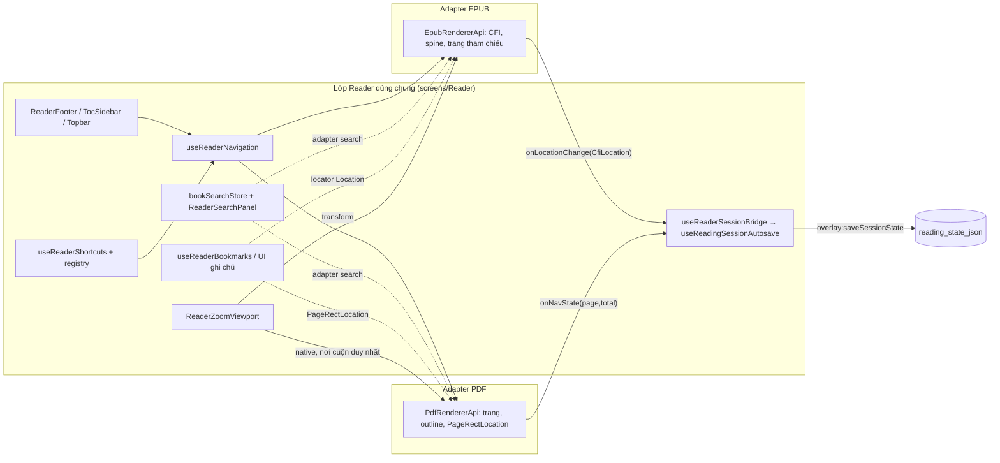

# Audit tái sử dụng code EPUB → PDF (Reader)

Chỉ audit + lập kế hoạch. Trạng thái repo lúc audit: nhánh `anle-dev`, commit `6343fdb`
(PDF cuộn liên tục + điều hướng dùng chung, xem `pdf_continuous_scroll.md`). Đường dẫn tính từ
`source/apps/reading-book-desktop/` trừ khi bắt đầu bằng `book-reader-sdk/`. "Chưa rõ" đánh dấu
những gì chưa xác minh trong code hoặc trong app đang chạy.

Phân loại: **A** dùng lại trực tiếp · **B** dùng lại qua adapter PDF · **C** tách phần dùng chung
trước · **D** giữ riêng theo định dạng.

## 1. Reader đang được nối như thế nào (đã lần theo code, không suy đoán)

- `screens/Reader/ReaderScreen.tsx` ghép mọi thứ. Mỗi hook tính năng nhận
  `isEpubSurface` + `epubApiRef` (từ `6343fdb`, navigation / shortcuts / session nhận thêm
  `isPdfSurface` + `pdfApiRef`) và rẽ nhánh theo định dạng. Không có interface "renderer" chung:
  hai handle là `EpubRendererApi` (`reader/renderers/epub/index.ts`) và `PdfRendererApi`
  (`reader/renderers/pdf/PdfRenderer.tsx`).
- Chọn renderer: `book.bookFormat` từ `library.openBookContent` → nhánh JSX trong `ReaderScreen`
  (`EpubRenderer` | `PdfRenderer` | `ReadingCanvas` giả). Công cụ toolbar lấy từ
  `reader/capabilities.ts`, nơi `readerSurfaceForFormat('pdf')` vẫn trả về `'placeholder'`.
- Điều hướng: footer / phím tắt / mục lục → `useReaderNavigation` (`switchPage`, `goToPage`,
  `goToStart`, `goToEnd`, `goToProgress`, `goToPageFromLayout`, `handleSelectTocItem`) → handle của
  renderer. Phím đến từ registry phím tắt (`shortcuts/shortcutDefinitions.ts`) qua
  `useShortcutAction` trong `useReaderShortcuts` / `useReaderZoomControls` / `ReaderFooter`.
- Vị trí → lưu trữ: EPUB `onLocationChange` → `useReaderSessionBridge.handleEpubLocationChange`;
  PDF `onNavState` → `handlePdfNavState`; cả hai → `hooks/reader/useReadingSessionAutosave.noteLocation`
  (debounce 750 ms / tối đa 5 s, flush khi blur, rời màn hình, thoát app) → `overlay:saveSessionState`
  → `books.reading_state_json`. Khôi phục: `useReaderBookOpen` → `parseResumeLocation` →
  `resumeLocation` (`CfiLocation` → EPUB, `PageRectLocation` → PDF).
- Truy cập file: `library.openBookContent(bookId)` → `electron/files/open-book-content.ts`
  (kiểm tra bằng `resolveBookFile`) → bytes qua IPC. Renderer không bao giờ thấy đường dẫn.

## 2. Ma trận tái sử dụng

| Tính năng | Cài đặt EPUB hiện có | Loại | Chiến lược cho PDF | Thay đổi cần làm | Độ phức tạp | Ưu tiên |
|---|---|---|---|---|---|---|
| Khung Reader / layout | `reader/chrome/ReaderShell.tsx`, inset trong `readerChromeLayout.ts` | A | PDF đã dùng | `readerChromeBottomInset(book.prefs.viewMode, …)` đọc chế độ xem EPUB cho cả PDF: pref `scroll` của sách thì chừa chỗ footer, `paginated` thì không. Cần truyền giá trị phù hợp cho PDF | Thấp | MVP |
| Tiêu đề, tab, Book Info | `useAppTitle`, `useOpenReading`, `BookInfoDialog` | A | Dùng nguyên | `BookInfoDialog` chỉ rơi về `'EPUB'` khi format rỗng; ổn | — | MVP (xong) |
| Mở / đang tải / lỗi / thử lại / relink | `useReaderBookOpen` (dùng chung `hooks/reader`), `ReaderOpenStatus`, `useBookRelink` | A | Dùng nguyên; PDF chờ session như EPUB (`isPdfSessionLoading`) | Không | — | MVP (xong) |
| Toolbar | `ReaderTopbar` + `reader/capabilities.ts` | B | Thêm `ReaderSurface` `'pdf'` với bộ capability riêng | Hiện PDF nhận bộ placeholder: hiện Aa (cài đặt font vô tác dụng với PDF) và Word Count (luôn "unsupported", chưa có text PDF trong `book_chunks`). Cập nhật `spike:reader:toolbar` | Thấp | MVP |
| Footer Prev/Next, ô trang, Go to Page, `<<` `>>`, kéo tiến độ | `ReaderFooter` + `useReaderNavigation` | B | Đã xong qua `PdfRendererApi` | Nút 1 trang / 2 trang vẫn hiện nhưng PDF bỏ qua; ẩn đi hoặc hỗ trợ (xem Cài đặt) | Thấp | MVP |
| Chỉ báo trang / tiến độ | Phần tính trang/section trong `ReaderScreen` | B | Đã xong (`nav.pdfNav`) | — | — | MVP (xong) |
| Panel mục lục | `TocSidebar` / `TocTree`, `handleSelectTocItem` | B | Đã xong: outline PDF chuyển thành `EpubTocItem` với href `pdf-page:N` | Chưa truyền mục đang đọc (`activeTocHref`) cho PDF; kiểu vẫn tên `EpubTocItem` (đổi sang tên trung lập = C, tuỳ chọn) | Thấp | Sau MVP |
| Tab ảnh thu nhỏ trang | `PageLayoutPanel`, `goToPageFromLayout` | B | Điều hướng theo trang; nhãn `Page N` | Ảnh thu nhỏ thật cần render PDF cỡ nhỏ (D). Chưa rõ panel hoạt động ra sao với 1000+ trang | Trung bình | Sau MVP |
| Fullscreen / immersive | `useImmersiveReading`, `useImmersiveChromeReveal`, `ImmersiveExitButton` | A | Không phụ thuộc định dạng | Không | — | MVP (xong) |
| Chạm giữa để ẩn/hiện chrome | `chrome.handleCenterTap` qua `EpubRenderer.onCenterTap` / `ReadingCanvas` | B | `PdfRenderer` chưa có callback chạm | Thêm prop `onCenterTap` | Thấp | Sau MVP |
| Xử lý Escape | `useReaderChromeUi` (`escapeUiRef.isEpubSurface` → `epubApiRef.clearSelection`) + Escape cho công cụ đang bật trong `useReaderNavigation` | A / B | Escape cấp window chạy được với PDF (không có iframe). Chưa nối việc bỏ chọn text PDF khi Escape | `clearSelection` tuỳ chọn trên `PdfRendererApi` | Thấp | Sau MVP |
| Điều phối điều hướng | `useReaderNavigation` rẽ nhánh theo `isEpubSurface` / `isPdfSurface` | B (xong) / C (tuỳ chọn) | Giữ hai handle tường minh. Interface `ReaderNavigator` chung sẽ bỏ được việc rẽ nhánh trong từng hàm nhưng chưa cần với hai định dạng | — | — | Xong |
| Giả định `FAKE_CHAPTERS` | `ReaderScreen` (nhãn chương, fallback mục lục), `useReaderBookmarks` (`chapterIndex`, `goChapter`), `useReaderNavigation` (`goChapter`, nhánh mặc định `chapterIndex`) | C | PDF đã bỏ qua chúng ở điều hướng, mục lục và footer. **Bookmark vẫn dùng** cho PDF (dòng bên dưới) | Gỡ phụ thuộc cuối cùng của PDF bằng adapter bookmark | Thấp | MVP |
| Phím tắt | Registry `shortcuts/`, `useShortcutAction`, `useReaderShortcuts`, `ReaderFooter` (Go to Page), `useReaderZoomControls` (zoom) | A | Cùng registry, cùng tuỳ chỉnh / phát hiện xung đột; `surfaceReady` giờ chờ cả handle PDF | Không. ←/→ + PageUp/Down = bước trang (registry), ↑/↓ + con lăn = cuộn tự nhiên | — | Xong |
| Chuyển tiếp phím từ iframe EPUB | `shortcuts/iframeKeydown.ts` (`listenKeydownInIframes`) | D (chỉ EPUB) | Không cần: PDF nằm trong document chính, listener của window đã bao | Không | — | — |
| Chặn khi đang gõ / contentEditable | `isTypingTarget` trong `iframeKeydown.ts`, dùng ở bridge và handler của Reader | A | Không phụ thuộc định dạng. Text layer PDF không chỉnh sửa được | Không | — | Xong |
| Phím undo/redo/xoá highlight | Effect keydown trong `useReaderNavigation` → `highlightShortcutsRef` | A (UI) | Vô hại với PDF (chưa có highlight) | Không | — | — |
| Lưu vị trí đọc | `useReadingSessionAutosave` (+ types), `useReaderSessionBridge`, `overlay:saveSessionState`, `reading_state_json` | B (xong) | `PageRectLocation(page).toString()` trong `lastReadLocation`, nhãn `Page N`, percent = trang/tổng. **Không cần migration**: cột lưu JSON của bất kỳ `Location` nào | — | — | Xong |
| Khôi phục | `parseResumeLocation`, `useReaderBookOpen` | B (xong) | Khôi phục theo trang | Vị trí trong trang có thể dùng `PageRectLocation.rect` (đã có trong model) | Thấp | Sau MVP |
| % tiến độ ở Thư viện | `library.ipc.ts` map `progressPercent` từ session | A | Dùng cùng percent | Chưa rõ: thẻ sách ở Thư viện hiển thị PDF có giống EPUB không (chưa kiểm tra trong app) | — | Kiểm tra |
| Nút zoom + phím tắt | `useReaderZoomControls`, `ZoomControl`, `view.zoomIn/Out/resetZoom` | A | Dùng chung | Không | — | Xong |
| Viewport zoom | `ReaderZoomViewport` (`mode="transform"` cho EPUB, `mode="native"` cho PDF) | B (xong) | PDF tự dàn trang theo zoom, viewport là nơi cuộn duy nhất; dùng chung công thức zoom quanh tiêu điểm | — | — | Xong |
| Vừa chiều rộng / vừa trang | `zoomForLayoutPreset` (SDK) + `getFitMetrics` | B (xong) | `getFitMetrics` trả kích thước 100% ở chế độ native | Chưa rõ: kết quả "vừa" với trang khác cỡ (dùng cả khối nội dung, không phải trang hiện tại) | Thấp | Kiểm tra |
| Kéo trang bằng Hand | EPUB: `onHandPanBy` → `handleHandPanBy` (cuộn viewport) | B | Hàm pan dùng chung đã cuộn được viewport native; chỉ là PDF chưa phát sự kiện kéo | Bắt pointer drag trong `PdfRenderer` khi tool = hand | Thấp | Sau MVP |
| Phân trang / đếm trang EPUB | `epub/progress/hidden-epub-pagination.ts`, `epub-pagination-cache.ts`, `reader-position.ts` | D | Không áp dụng: PDF có trang thật | Không | — | — |
| Chế độ xem EPUB (lật / cuộn), layout 1/2 trang | Prop của `EpubRenderer` từ `ReadingPrefs` | D | PDF là một cột cuộn liên tục; đã ẩn nút chuyển với PDF | Quyết định sau có cho PDF hiển thị 2 trang không | — | Sau MVP |
| UI + state panel tìm kiếm | `ReaderSearchPanel`, `search/bookSearchStore.ts` (query, phân trang kết quả, trạng thái, vị trí panel) | B | UI, phân tích query (`parseTextSearchQuery`), phân trang, luồng "đang index" đều dùng lại được | Store gọi `epubApiRef.setSearchHighlights` / `goToSearchMatch({ spineIndex, occurrence, count })` và thoát sớm khi `!isEpubSurface`. Cần một adapter search nhỏ (`paint(matcher)`, `goToMatch(match)`) cho từng định dạng | Trung bình | Sau MVP (giai đoạn 4) |
| Index tìm kiếm (FTS ở Main) | `electron/chunking/extract-book-text.ts` (`CHUNKABLE_FORMATS` = epub, txt, md), `book_chunks`, `electron/search` | B | Thêm bộ trích text PDF ở Main (đoạn văn theo trang, `chapterIndex = page - 1`) để FTS và DTO kết quả (`chapterIndex`, `chapterOccurrence`) chạy nguyên | Nhánh PDF mới trong `extractBookParagraphs` dùng pdf.js trong Node. Chưa rõ: `pdfjs-dist` 5.4.624 chạy được nguyên trong Main / worker thread của Electron hay phải dùng bản `legacy` | Trung bình | Sau MVP |
| Tô kết quả / nhảy tới kết quả | `epub/search/epubSearchDom.ts` | D | PDF: đánh dấu span trong text layer PDF.js của các trang đã render, cuộn tới trang rồi tới span | Code PDF mới | Trung bình | Sau MVP |
| Đếm từ (Word Count) | `electron/wordcount` đọc `book_chunks` | A sau khi có bộ trích | Tự chạy khi có chunk PDF | Không gì thêm ngoài bộ trích; ẩn công cụ tới lúc đó | — | Sau MVP |
| Chọn text | EPUB: `cfi/selection-cfi.ts`, handler chọn trong iframe | D | Text layer PDF.js cho chọn text tự nhiên (đã chạy) | Copy chạy tự nhiên; chưa nối chọn text → menu ngữ cảnh | — | — |
| Menu ngữ cảnh khi chọn text | `HighlightContextMenu` (UI) lấy dữ liệu từ `highlights.selectionMenu` qua sự kiện EPUB | B | UI dùng lại được; PDF cần adapter phát sự kiện chọn text | Phụ thuộc annotation | Trung bình | Sau MVP |
| Dịch | `useReaderTranslation`, `TranslationPopover`, worker dịch ở Main | B | Nhận text đã chọn; PDF chỉ cần nguồn sự kiện chọn text | Capability + nối sự kiện chọn | Thấp–Trung bình | Sau MVP |
| Đọc to | `useReadAloud`, `epub/readAloud/epubReadAloudDom.ts` | B (UI) / D (duyệt DOM) | Menu + store dùng lại được; nguồn text và "đọc theo vị trí" là việc DOM của renderer | Bộ duyệt text layer PDF | Trung bình | Về sau |
| Bookmark | `useReaderBookmarks`, SDK `app-models/bookmark-location.ts` (`packBookmarkLocator(location, chapterIndex)`) | B | Định dạng locator đã nhận mọi `Location`: đóng gói `PageRectLocation(page)` với `chapterIndex = page - 1`; nhảy bằng `pdfApiRef.goToPage` | Hiện PDF đi nhánh không phải EPUB: `chapterIndex` giả + `goChapter` → bookmark PDF thực chất sai. Thêm nhánh `isPdfSurface` / `pdfApiRef` trong `resolveCurrentBookmarkLocation` + `jumpToBookmark`; excerpt tuỳ chọn | Thấp | **MVP** |
| Danh sách annotation / UI ghi chú | Tab notes trong `TocSidebar`, `NoteFloatingMenu`, `HighlightEditPopup`, `notesFilterStore`, `groupHighlightsByChapter` | A (UI) | Dùng lại được khi PDF có highlight; nhóm theo `chapterIndex` = trang | Chưa cần | — | Về sau |
| Lưu annotation | IPC `overlay` + `HighlightDto.locatorRef` (JSON `Location` + `chapterIndex`) | A | Cùng bảng/DTO: lưu `PageRectLocation(page, rect)` (hoặc một locator vùng text PDF mới) vào `locatorRef`. **Không cần đổi schema** cho phần lưu | Quyết định dạng neo PDF (xem §5) | — | Về sau |
| Neo + vẽ annotation | `highlightsStore` (`CfiLocation`, `applyAllHighlights` qua handle epub), `cfi/cfi-dom-range.ts`, highlight overlay | D | Neo PDF là trang + offset text/quads vẽ trên canvas — cài đặt riêng | Lớp overlay PDF mới | Cao | Về sau |
| Xuất annotation PDF / ghi vào file | — | D | Ngoài phạm vi; vi phạm nguyên tắc "không bao giờ sửa file sách" trừ khi xuất ra bản sao | — | — | Không |
| Chụp màn hình (Snapshot) | `useSnapshotTool` (Main `capturePage`) | A | Không phụ thuộc renderer | Không | — | MVP (chạy được) |
| Cài đặt đọc (Aa) | `AaSettingsPanel`, `ReadingPrefs`, `readmate.globalReadingPrefs.v1`, ghi đè theo sách trong `reading_state_json` | D (reflow EPUB) / A (theme) | Font, cỡ chữ, giãn dòng, căn lề, lề là cài đặt reflow — vô nghĩa với PDF. Theme / màu nhấn / mật độ của app dùng chung | Ẩn Aa cho PDF qua capabilities. Zoom PDF không được lưu (reset mỗi sách trong `useReaderZoomControls`); lưu zoom sẽ là cài đặt mới — không đề xuất ở đây | Thấp | MVP (ẩn) |
| Tải file / IPC / bảo mật | `library.openBookContent` → `resolveBookFile` → bytes; `pdf.adapter.ts` chỉ là importer theo tên file | A | PDF dùng cùng đường an toàn; không cần IPC mới | File lớn được gửi nguyên qua IPC (chưa rõ giới hạn / bộ nhớ với file rất lớn); metadata/bìa PDF khi import vẫn là stub (`createFilenameFallbackImporter`) | — / Trung bình | Xong / Về sau |
| Trạng thái chữ ký | `electron/signature/` (xác minh PDF) | A | Độc lập với reader | Không | — | — |
| Vòng đời / dọn dẹp | `EpubRenderer` key theo `bookId`; reset state điều hướng theo `bookId` trong `useReaderNavigation` | A (pattern) / D (tài nguyên) | `PdfRenderer` key theo `bookId`, huỷ tác vụ render, xoá canvas, `task.destroy()` | Không có helper vòng đời chung đáng tách (hai renderer, tài nguyên rất khác nhau) | — | Xong |

## 3. Danh sách ưu tiên

**Dùng lại ngay (A, đã chạy với PDF):** khung Reader, trạng thái mở/lỗi/relink, tiêu đề & Book
Info, fullscreen/immersive, registry phím tắt + chặn khi gõ + tuỳ chỉnh, nút và phím tắt zoom,
snapshot, tải file an toàn, luồng autosave phiên đọc, trạng thái chữ ký, theme.

**Dùng lại sau một adapter nhỏ (B):** capabilities toolbar (surface `'pdf'`), bookmark (locator
`PageRectLocation`), nút layout footer / khoảng chừa footer, chạm giữa, kéo Hand, store tìm kiếm
(adapter search) + bộ trích text PDF ở Main (rồi Word Count tự có), dịch, menu khi chọn text, mục
đang đọc trong mục lục, menu đọc to.

**Giữ riêng (D):** mô hình phân trang/đếm trang EPUB, codec CFI và chọn text → CFI, chế độ xem
EPUB, tô kết quả tìm kiếm trên DOM EPUB, duyệt DOM đọc to EPUB, chuyển tiếp phím từ iframe, cài
đặt reflow Aa; phía PDF: raster trang/ảo hoá, tô kết quả trên text layer, neo và vẽ annotation PDF,
phân giải outline.

## 4. Các giả định EPUB rủi ro nhất còn trong code dùng chung

1. `useReaderBookmarks` — nhánh không phải EPUB dùng `chapterIndex` giả / `goChapter`; bookmark
   PDF hiện trỏ vào chương giả, và nút bookmark ở footer vẫn bấm được với PDF.
2. `reader/capabilities.ts` — PDF dùng lại bộ `placeholder`, nên Aa và Word Count hiện với PDF
   nhưng không làm được gì hữu ích.
3. `bookSearchStore` — gắn cứng với `EpubRendererApi` (`setSearchHighlights`, `goToSearchMatch`);
   Main báo PDF là `unsupported`. Công cụ tìm kiếm hiện bị ẩn với PDF (không có capability
   `search`), nên đây là chỗ thiếu, không phải lỗi.
4. `highlightsStore` / `useReaderHighlights` — neo bằng `CfiLocation` và vẽ qua handle epub; bị chặn
   bởi `isEpubSurface`, nên không ảnh hưởng PDF (không phải lỗi).
5. `ReaderScreen` — `readerChromeBottomInset(book.prefs.viewMode, …)` và nút `layout` ở footer vẫn
   đọc cài đặt đọc EPUB khi đang mở PDF.

## 5. Kiến trúc đề xuất cho PDF MVP

Giữ những gì đang có: một lớp Reader dùng chung cộng một handle cho mỗi renderer, việc rẽ nhánh
theo định dạng nằm trong vài hook điều phối. Chưa cần interface `ReaderSurface` tổng quát cho hai
định dạng; chỉ thêm adapter nhỏ theo từng tính năng ở chỗ hook đang gọi thẳng `EpubRendererApi`
(search, bookmark).

- **Lớp dùng chung:** các nút điều khiển, registry phím tắt, điều phối điều hướng, autosave phiên
  đọc, panel/state tìm kiếm, UI bookmark/ghi chú, viewport zoom, capabilities.
- **Adapter EPUB:** `EpubRendererApi` (CFI, spine, trang tham chiếu, tô trên DOM iframe).
- **Adapter PDF:** `PdfRendererApi` (`goToPage`, `nextPage`, `prevPage`, `getNavState`,
  `getCurrentLocation`), `onNavState`, `onOutline`; sau này thêm `paintSearch` /
  `goToSearchMatch(page, occurrence)` và lớp overlay annotation.
- **Báo vị trí:** mỗi renderer báo loại `Location` của mình; autosave dùng chung lưu
  `Location.toString()` — vốn đã trung lập định dạng.
- **Khôi phục:** `parseResumeLocation` trả về loại con; `ReaderScreen` chỉ giao cho mỗi renderer
  đúng loại của nó.
- **Tìm kiếm:** giữ index FTS trung lập định dạng (`chapterIndex` = chỉ số spine với EPUB, chỉ số
  trang với PDF). Store nhận một adapter nhỏ `{ paint(matcher | null), goToMatch(match) }` chọn
  theo surface thay vì gọi thẳng handle EPUB.
- **Annotation (tương lai):** dùng chung DTO, lưu trữ, danh sách ghi chú và popup; giữ cách neo
  riêng theo định dạng (vùng `CfiLocation` vs. `PageRectLocation(page, rect)` + quads text) và việc
  vẽ riêng theo renderer. Nhóm theo `chapterIndex` ứng với trang ở PDF.

## 6. Kế hoạch triển khai

Các giai đoạn 1–3 của trình tự ban đầu (lỗi runtime, cuộn liên tục, điều hướng dùng chung, theo
dõi trang + lưu vị trí) đã được cài đặt trong `6343fdb` nhưng **chưa kiểm tra thủ công**. Vì vậy kế
hoạch bắt đầu bằng việc kiểm tra.

### Giai đoạn 1 — Kiểm tra những gì đã làm
- Phạm vi: kiểm tra thủ công trong app (`npm run dev`) với một PDF nhỏ, một PDF 500+ trang, một PDF
  có trang khác cỡ và một PDF có outline; kiểm tra hồi quy EPUB.
- File: không có, trừ khi phát hiện lỗi (`PdfRenderer.tsx`, `ReaderZoomViewport.tsx`).
- Tiêu chí đạt: cuộn liên tục, chỉ báo trang theo kịp khi cuộn, Prev/Next/Go to/Home/End, phím tắt
  chỉ chạy một lần, mở lại khôi phục đúng trang, zoom (nút, Ctrl+wheel, vừa trang) giữ chỗ đang đọc,
  không còn lỗi cache Vite (`getOrInsertComputed`).
- Hồi quy: điều hướng EPUB lật trang + cuộn, khôi phục EPUB, zoom EPUB, `npm run typecheck`,
  `npx vite build`, `spike:reader:toolbar`, `spike:session:roundtrip`.

### Giai đoạn 2 — Capabilities và chrome cho PDF
- Phạm vi: thêm `'pdf'` vào `ReaderSurface` trong `reader/capabilities.ts` (interaction, snapshot;
  chưa có Aa, chưa có Word Count tới khi có text); ẩn nút layout 1/2 trang ở footer với PDF;
  `readerChromeBottomInset` theo PDF; `onCenterTap` cho PDF.
- File: `reader/capabilities.ts`, `ReaderScreen.tsx`, `ReaderFooter.tsx` (prop tuỳ chọn để ẩn
  layout), `PdfRenderer.tsx`, `spikes/reader-toolbar/*`.
- Tiêu chí đạt: toolbar PDF chỉ hiện công cụ hoạt động được; toolbar EPUB không đổi.
- Hồi quy: `spike:reader:toolbar`, xem lại toolbar/footer EPUB.

### Giai đoạn 3 — Bookmark PDF qua locator sẵn có
- Phạm vi: `useReaderBookmarks` nhận `isPdfSurface` + `pdfApiRef`; vị trí hiện tại =
  `PageRectLocation(page)` đóng gói với `chapterIndex = page - 1`; nhảy → `goToPage`.
- File: `useReaderBookmarks.ts`, có thể cả `book-reader-sdk/src/app-models/bookmark-location.ts`
  (`resolveCurrentBookmarkLocation`), `ReaderScreen.tsx`.
- Tiêu chí đạt: thêm / xoá / nhảy / nhãn "Here" chạy với PDF; không đổi schema.
- Hồi quy: bookmark EPUB (thêm, nhảy, locator giả cũ vẫn parse được).

### Giai đoạn 4 — Trích text PDF + tìm kiếm dùng chung
- Phạm vi: nhánh PDF trong `extractBookParagraphs` (text pdf.js theo trang, `chapterIndex = page - 1`);
  adapter search trong `bookSearchStore`; tô kết quả PDF trên text layer và nhảy tới
  trang/lần xuất hiện; bật capability `search` (và `wordCount`) cho PDF.
- File: `electron/chunking/extract-book-text.ts` (+ worker nếu cần),
  `screens/Reader/logic/search/bookSearchStore.ts`, `useReaderSearch.ts`, `PdfRenderer.tsx`,
  `reader/capabilities.ts`.
- Tiêu chí đạt: Ctrl+F tìm được text trong PDF có text, Next/Prev kết quả cuộn tới và đánh dấu;
  PDF scan báo "không có text" rõ ràng; Word Count chạy.
- Hồi quy: tìm kiếm + tô kết quả EPUB, index txt/md, huỷ job chunk.
- Câu hỏi mở: pdf.js trong Main / worker thread (cần bản legacy không?) — xác minh trước.

### Giai đoạn 5 — Công cụ theo vùng chọn (dịch, menu ngữ cảnh, kéo Hand)
- Phạm vi: sự kiện chọn text PDF → `HighlightContextMenu` (chỉ Copy, Dịch) và popover dịch; kéo
  trang bằng Hand qua `handleHandPanBy` dùng chung.
- File: `PdfRenderer.tsx`, `ReaderScreen.tsx`, `reader/capabilities.ts`.
- Tiêu chí đạt: chọn → menu → dịch chạy; kéo Hand di chuyển trang; Select vẫn chọn được text.
- Hồi quy: menu chọn text EPUB, kéo Hand EPUB.

### Giai đoạn 6 — Annotation PDF (thiết kế trước)
- Phạm vi: quyết định cách neo PDF (`PageRectLocation(page, rect)` + quads text hoặc offset trên
  text layer), vẽ overlay, dùng lại UI/lưu trữ ghi chú. Viết tài liệu thiết kế riêng trước khi code.
- Không thuộc PDF MVP.

## 7. Cách kiểm chứng audit này

Chỉ đọc: kiểm tra source bằng grep/đọc file; không thay đổi code, dependency, schema hay IPC. Các
mục ghi "Chưa rõ" chưa được xác minh trong app đang chạy.
