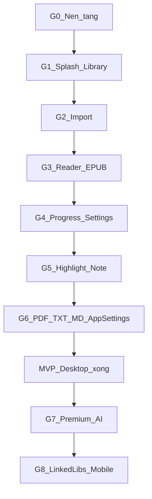

# 00 — Tổng quan & thứ tự làm

## Mục lục

- [1. Mục tiêu bộ kế hoạch](#1-mục-tiêu-bộ-kế-hoạch)
- [2. Bản đồ giai đoạn](#2-bản-đồ-giai-đoạn)
- [3. Phụ thuộc giữa các phần](#3-phụ-thuộc-giữa-các-phần)
- [4. Nguyên tắc khi code](#4-nguyên-tắc-khi-code)
- [5. Định nghĩa “xong một giai đoạn”](#5-định-nghĩa-xong-một-giai-đoạn)
- [6. Phạm vi cố ý không làm sớm](#6-phạm-vi-cố-ý-không-làm-sớm)

---

## 1. Mục tiêu bộ kế hoạch

Chia việc xây **Readmate** thành các giai đoạn nhỏ, mỗi giai đoạn:

1. Có **một outcome** người dùng cảm nhận được (hoặc một nền tảng kỹ thuật bắt buộc).
2. Map rõ sang **FR / SCR / mockup**.
3. Có **checklist nghiệm thu** trước khi sang bước sau.

Ưu tiên: **đọc được EPUB local → resume → highlight/note** trước khi mở rộng format và AI.

## 2. Bản đồ giai đoạn

| Giai đoạn                          | Outcome ngắn                                | FR chính                   | Màn / mockup       |
| ---------------------------------- | ------------------------------------------- | -------------------------- | ------------------ |
| **G0** Nền tảng                    | App chạy, DB + IPC sẵn                      | —                          | skeleton           |
| **G1** Splash + Library            | Mở app thấy brand → thư viện (có thể trống) | FR-08                      | splash, library    |
| **G2** Import                      | Thêm EPUB từ máy / URL vào thư viện         | FR-01, FR-13               | import             |
| **G3** Reader EPUB                 | Mở sách, đọc, Invisible UI                  | FR-02, FR-03               | reading            |
| **G4** Tiến độ + Reading Settings  | Resume đúng chỗ; đổi theme/font             | FR-04, FR-05, FR-10        | reading (Settings) |
| **G5** Highlight / Note / Bookmark | Bôi chọn → lưu → xem lại trong sidebar      | FR-06, FR-07, FR-09, FR-11 | reading sidebar    |
| **G6** Đa format + App Settings    | PDF/TXT/MD + SCR-06 + xóa sách              | FR-02 (rộng), FR-12, NFR   | setting            |
| **G7** Premium AI                  | Chat/RAG, tóm tắt, flashcards (opt-in)      | FR-20+                     | panel AI           |
| **G8** Linked libraries + Mobile   | Connector Drive/Books/Apple Books; mobile   | FR-30 + Phase 3            | setting (libraries) |

## 3. Phụ thuộc giữa các phần

| Phải có trước                 | Mới làm được                |
| ----------------------------- | --------------------------- |
| Types + SQLite + sandbox file | Import                      |
| Import ≥ 1 sách               | Reader có nội dung thật     |
| Reader + LocationCodec        | Progress / highlight        |
| Highlight ổn định             | AI (G7) dựa trên text range |
| Domain ổn ở packages          | Mobile parity (G8)          |

**Không** làm song song Reader PDF và AI khi EPUB chưa resume được — dễ lệch model `Location`.

## 4. Nguyên tắc khi code

1. **Layered** — UI không SQL; Main không React; domain không Electron (theo SDS §2).
2. **File gốc Read-Only** — annotation chỉ Overlay SQLite (BR-01, BR-02).
3. **Một format trước** — EPUB đủ DoD rồi mới PDF.
4. **Không phá flow** — không popup / ads trong vùng đang đọc (NFR-02).
5. **Shared trước khi nhân đôi** — domain models trong `packages/domain`; use cases sách/session/highlight trong `packages/shared` sớm.
6. **Bám mockup** — `docs/mockups/*.html` là nguồn UI; SDS §4 là nguồn IA.

## 5. Định nghĩa “xong một giai đoạn”

Mỗi giai đoạn đạt khi:

- [ ] Outcome người dùng (hoặc nền tảng) đã mô tả trong file giai đoạn
- [ ] Acceptance / FR liên quan pass thủ công
- [ ] Không còn hack “tạm” chặn giai đoạn sau (hoặc đã ghi nợ rõ trong PR/note)
- [ ] Checklist ở [10_Checklist_nghiem_thu.md](./10_Checklist_nghiem_thu.md) đã cập nhật

## 6. Phạm vi cố ý không làm sớm

| Không làm trong G0–G6            | Lý do                  |
| -------------------------------- | ---------------------- |
| AI Chat / tóm tắt tự động        | Phá flow; thuộc G7     |
| Linked libraries / không đăng nhập app | Connector Drive/Books/Apple Books thuộc G8; **không** email/password hay OAuth2 identity |
| Sync account đa thiết bị             | **Không làm** — đã loại khỏi sản phẩm |
| Marketplace / DRM                | Ngoài phạm vi sản phẩm |
| MOBI / AZW3 / DOCX               | Ngoài MVP              |
| Màn Highlights toàn cục (SCR-04) | Đã gỡ khỏi SDS 1.7     |
| OCR PDF scan hàng loạt           | Spike riêng nếu cần    |

