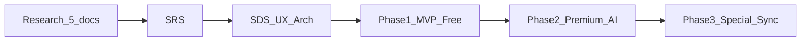

# 00 — Overview & Roadmap

## Mục lục

- [1. Tầm nhìn sản phẩm](#1-tầm-nhìn-sản-phẩm)
- [2. Persona & gói sản phẩm (map từ research)](#2-persona--gói-sản-phẩm-map-từ-research)
- [3. Roadmap theo phase](#3-roadmap-theo-phase)
  - [Phase 0 — Chốt yêu cầu & thiết kế (docs)](#phase-0--chốt-yêu-cầu--thiết-kế-docs)
  - [Phase 1 — MVP Free Core (Desktop)](#phase-1--mvp-free-core-desktop)
  - [Phase 2 — Premium AI](#phase-2--premium-ai)
  - [Phase 3 — Special Linked Libraries & Knowledge Graph](#phase-3--special-linked-libraries--knowledge-graph)
- [4. Nguyên tắc ưu tiên (luôn giữ)](#4-nguyên-tắc-ưu-tiên-luôn-giữ)
- [5. Rủi ro chính](#5-rủi-ro-chính)
- [6. Tiêu chí thành công sản phẩm (north star)](#6-tiêu-chí-thành-công-sản-phẩm-north-star)

---

## 1. Tầm nhìn sản phẩm

Ứng dụng đọc tài liệu/sách thông minh: **không gian đọc yên tĩnh** trước, **trợ lý tri thức** sau.

Người dùng quên họ đang dùng phần mềm và “sống” cùng nội dung; AI chỉ xuất hiện khi được gọi.

## 2. Persona & gói sản phẩm (map từ research)

| Persona           | Pain chính                          | Gói đáp ứng                                  | Phase         |
| ----------------- | ----------------------------------- | -------------------------------------------- | ------------- |
| Nhà chiêm nghiệm  | Quên nội dung, cần flow             | Free: đọc sạch, highlight, tiến độ           | MVP           |
| Thợ săn thông tin | Tìm chậm trong tài liệu dài         | Premium: Chat/RAG, tóm tắt, semantic search  | Phase 2       |
| Người sưu tầm     | Thư viện lộn xộn, không biết đọc gì | Free cơ bản + Special: auto-tag, gợi ý, linked libraries | MVP → Phase 3 |
| Người kết nối     | Cô độc khi đọc                      | Special / sau: quote cards, chia sẻ          | Phase 3+      |

## 3. Roadmap theo phase

### Phase 0 — Chốt yêu cầu & thiết kế (docs)

- Viết SRS từ pain + habit + persona
- Viết SDS + IA màn hình theo Design System
- Chốt domain model chung trong `source/packages/domain`

**Done when:** SRS/SDS có acceptance criteria cho MVP; backlog Phase 1 đã cắt scope.

### Phase 1 — MVP Free Core (Desktop)

- Import / mở EPUB (và PDF nếu khả thi sớm; nếu không thì EPUB trước)
- Reader Invisible UI (theme light / sepia / dark, font, size, line-height)
- Thư viện + “Đọc tiếp”
- Highlight (1–2 thao tác) + note
- Lưu tiến độ đọc local
- Trang tổng hợp highlight / note theo sách

**Done when:** Người dùng mở sách → đọc phiên ngắn → đóng → mở lại đúng vị trí; highlight/note xem lại được.

### Phase 2 — Premium AI

- AI Chat theo ngữ cảnh đoạn / sách (RAG trong 1 tài liệu)
- Tóm tắt chương / đoạn khi user chủ động gọi
- Flashcards từ highlight + spaced repetition
- Semantic search trong tài liệu
- Monetization: Free có banner sau ngưỡng thời gian; Premium bỏ ads trong reader

**Done when:** Deep Reader ôn được từ highlight; Researcher hỏi được nội dung sách có citation đoạn.

### Phase 3 — Special Linked Libraries & Knowledge Graph

- Liên kết thư viện ngoài: **Google Drive**, **Google Books**, **Apple Books** — kéo danh sách tài liệu vào Library local
- **Không** tài khoản app (email/password / OAuth2 đăng nhập)
- Auto-tagging thư viện
- Dashboard thống kê thói quen đọc
- Gợi ý đọc / workflow học tập
- Kết nối ý tưởng giữa nhiều sách (knowledge links)
- Quote cards / chia sẻ (Social persona)
- Special: không ads trên mọi màn hình

**Done when:** Catalog từ nguồn ngoài vào được Library local; thư viện có tổ chức thông minh; power user có dashboard.

## 4. Nguyên tắc ưu tiên (luôn giữ)

1. **Flow trước AI** — không phá trải nghiệm đọc để bán tính năng.
2. **User control** — AI không tự tóm tắt / tự tag nếu user chưa bật.
3. **Highlight là trung tâm** — thao tác phổ biến nhất → tối ưu trước.
4. **Phiên ngắn** — cold start mở sách phải nhanh; resume chính xác.
5. **Shared domain** — models ở `packages/domain`, use cases sách/highlight/session ở `packages/shared`; UI thin ở từng app.

## 5. Rủi ro chính

| Rủi ro                     | Mitigation                                          |
| -------------------------- | --------------------------------------------------- |
| PDF render phức tạp        | MVP ưu tiên EPUB; PDF = phase 1.5 hoặc 2            |
| AI phá flow                | Invisible Assistance: chỉ khi bôi đen / mở panel    |
| Linked libraries complexity | Phase 3: folder/path connectors trước; không OAuth2 identity |
| Scope creep persona Social | Để sau Phase 3 core linked libraries                    |

## 6. Tiêu chí thành công sản phẩm (north star)

- Thời gian từ mở app → đọc lại đúng trang: **< 3 giây** (local library)
- Highlight: **≤ 2 thao tác**
- Trong phiên đọc: không có popup đánh giá / upsell giữa nội dung (upsell chỉ ngoài reader hoặc sau ngưỡng Free đã định nghĩa)

