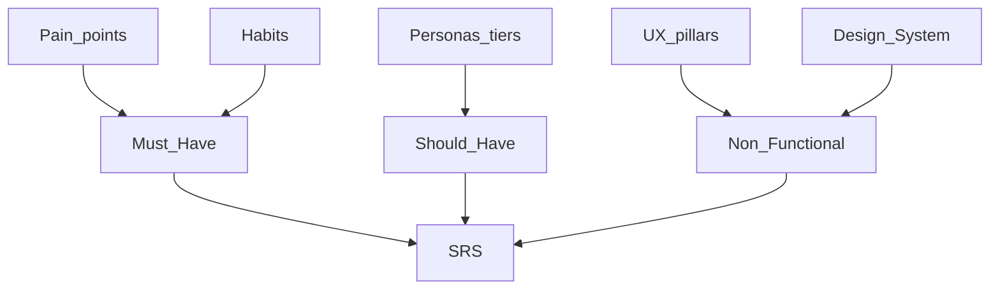

# 01 — Xác định yêu cầu (Requirements)


## Mục lục

- [1. Quy trình viết SRS](#1-quy-trình-viết-srs)
  - [Bước 1 — Liệt kê vấn đề (Problem backlog)](#bước-1--liệt-kê-vấn-đề-problem-backlog)
  - [Bước 2 — Map habit → requirement](#bước-2--map-habit-→-requirement)
  - [Bước 3 — Cắt theo gói (scope gate)](#bước-3--cắt-theo-gói-scope-gate)
  - [Bước 4 — Viết user stories + acceptance criteria](#bước-4--viết-user-stories--acceptance-criteria)
- [2. Danh sách yêu cầu chức năng đề xuất (điền vào SRS)](#2-danh-sách-yêu-cầu-chức-năng-đề-xuất-điền-vào-srs)
  - [Must — Phase 1 (MVP)](#must--phase-1-mvp)
  - [Should — Phase 2](#should--phase-2)
  - [Could — Phase 3](#could--phase-3)
- [3. Non-functional requirements (NFR)](#3-non-functional-requirements-nfr)
- [4. Out of scope (MVP)](#4-out-of-scope-mvp)
- [5. Checklist trước khi coi SRS xong](#5-checklist-trước-khi-coi-srs-xong)

---

Mục tiêu: biến research thành [`docs/software/SRS.md`](../software/SRS.md) có thể implement và test được.

## 1. Quy trình viết SRS



### Bước 1 — Liệt kê vấn đề (Problem backlog)

Lấy từ [Nỗi_đau_khi_đọc_sách.md](../reading-habbit/Nỗi_đau_khi_đọc_sách.md):

| ID | Pain | Nhóm |
| :--- | :--- | :--- |
| P01 | Cognitive overload / UI phức tạp | Tập trung |
| P02 | Flow bị đứt (latency, notification, UI ồn) | Tập trung |
| P03 | Đọc xong quên | Ghi nhớ |
| P04 | Document clutter | Quản lý |
| P05 | Không tìm theo nội dung / khái niệm | Quản lý |
| P06 | Mất metadata / khó truy xuất | Quản lý |
| P07 | Thư viện phân tán trên Drive / Books / Apple Books — khó gom vào một Library | UX |
| P08 | Note/highlight cô lập, không nối ý tưởng | UX |
| P09 | Thiếu ngữ cảnh thảo luận | UX |
| P10 | Collector's guilt | Tâm lý |
| P11 | Sợ AI tự ý xử lý nội dung | Tâm lý |

### Bước 2 — Map habit → requirement

Từ [Thoi_quen_nguoi_doc_sach.md](../reading-habbit/Thoi_quen_nguoi_doc_sach.md):

| Habit | Requirement gợi ý | Phase |
| :--- | :--- | :--- |
| Phiên 10–30 phút | Cold start nhanh; resume chính xác | MVP |
| Nhiều sách cùng lúc | Library + Continue Reading | MVP |
| Highlight nhiều | Highlight 1–2 tap; trang tổng hợp | MVP |
| Ghi chú học tập | Inline / margin notes | MVP |
| Tra từ (ngoại ngữ) | Lookup / dịch đoạn | Phase 2 |
| Quay lại highlight hơn đọc lại cả sách | Review highlights screen | MVP |
| Cá nhân hóa typography/theme | Reading settings persist | MVP |
| Theo dõi tiến độ | % / trang / thời gian đọc | MVP → Phase 3 stats |
| Học: đọc → highlight → note → ôn | Flashcards + SRS | Phase 2 |
| Giải trí: UI tối giản | Invisible UI, ít chrome | MVP |

### Bước 3 — Cắt theo gói (scope gate)

Từ [Reader_Personas_Analysis.md](../reading-habbit/Reader_Personas_Analysis.md):

- **Free (MVP):** Chiêm nghiệm — reader sạch, highlight, tiến độ; banner ads sau ngưỡng thời gian (có thể stub / feature-flag ở MVP kỹ thuật).
- **Premium:** Thợ săn + Chiêm nghiệm nâng cao — AI Chat, flashcards, spaced repetition, tóm tắt chương, semantic search; bỏ ads trong reader.
- **Special:** Sync, auto-tag, dashboard, knowledge workflow, personal AI; no ads everywhere.

### Bước 4 — Viết user stories + acceptance criteria

Template mỗi requirement trong SRS:

```text
ID: FR-xxx
Persona: ...
Pain: Pxx
Story: As a ..., I want ..., so that ...
Acceptance:
  - Given ... When ... Then ...
Priority: Must | Should | Could
Phase: 1 | 2 | 3
```

## 2. Danh sách yêu cầu chức năng đề xuất (điền vào SRS)

### Must — Phase 1 (MVP)

| ID | Tên | Pain |
| :--- | :--- | :--- |
| FR-01 | Import / thêm sách vào thư viện local | P04, P06 |
| FR-02 | Mở sách và render nội dung (EPUB) | P01, P02 |
| FR-03 | Lật trang / cuộn mượt, UI ẩn mặc định | P01, P02 |
| FR-04 | Theme light / sepia / dark + font/size/line-height | Habit #7 |
| FR-05 | Lưu & khôi phục vị trí đọc | Habit #1 |
| FR-06 | Highlight selection (≤ 2 thao tác) | Habit #3 |
| FR-07 | Thêm / sửa / xóa note gắn đoạn | Habit #4 |
| FR-08 | Danh sách thư viện + Continue Reading | Habit #2 |
| FR-09 | Trang tổng hợp highlight & note theo sách | Habit #6 |
| FR-10 | Progress bar mỏng / % hoàn thành | Habit #8 |

### Should — Phase 2

| ID | Tên | Pain |
| :--- | :--- | :--- |
| FR-20 | AI giải thích / tóm tắt đoạn khi user chọn | P01, P11 |
| FR-21 | Chat Q&A trong phạm vi 1 sách (RAG) | Researcher |
| FR-22 | Semantic search trong sách | P05 |
| FR-23 | Tạo flashcard từ highlight | P03 |
| FR-24 | Spaced repetition review | P03 |
| FR-25 | Tóm tắt highlight của một sách | Habit #13 |
| FR-26 | Freemium gate + ads policy theo gói | Monetization |

### Could — Phase 3

| ID | Tên | Pain |
| :--- | :--- | :--- |
| FR-30 | Liên kết thư viện ngoài (Google Drive, Google Books, Apple Books) — không tài khoản app | P07 |
| FR-31 | Auto-tagging (opt-in) | P04, P11 |
| FR-32 | Reading stats dashboard | Collector |
| FR-33 | Link ý tưởng giữa sách | P08 |
| FR-34 | Quote card & share | P09 |
| FR-35 | Reading suggestions / learning workflow | P10 |

## 3. Non-functional requirements (NFR)

Từ [UX_of_Reading.md](../reading-habbit/UX_of_Reading.md) + Design System:

| ID | Yêu cầu |
| :--- | :--- |
| NFR-01 | Reader chrome mặc định ẩn; hiện khi tap center / selection |
| NFR-02 | Không popup giữa phiên đọc (rate app, feature promo) |
| NFR-03 | Theme switch không reload toàn bộ document (CSS variables / style engine) |
| NFR-04 | Mở lại sách local &lt; 3s trên máy mid-range (target) |
| NFR-05 | AI không chạy auto trên nội dung trừ khi user bật / gọi |
| NFR-06 | Dữ liệu Free/MVP lưu local-first; không bắt buộc cloud / connector ở MVP |
| NFR-11 | Không tài khoản app: cấm email/password và OAuth2 Sign-in identity |
| NFR-07 | Accessibility: contrast đủ ở 3 theme; font size adjustable |

## 4. Out of scope (MVP)

- Social feed / cộng đồng thảo luận realtime
- Marketplace sách / DRM store
- OCR hàng loạt PDF scan (trừ spike riêng)
- AI tự động tóm tắt cả thư viện không hỏi user
- Sync realtime đa thiết bị

## 5. Checklist trước khi coi SRS xong

- [ ] Mỗi Must có acceptance criteria kiểm thử được
- [ ] Mỗi Must map được ≥ 1 pain hoặc habit
- [ ] Không có Must thuộc Premium/Special lọt vào Phase 1
- [ ] Ads / monetization ghi rõ hành vi (khi nào hiện, vùng nào cấm)
- [ ] SRS được review với Design System don'ts
