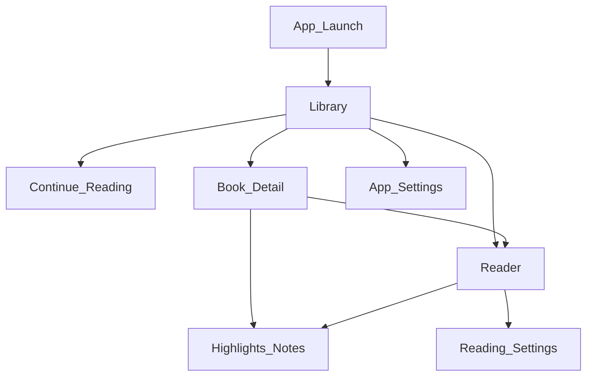
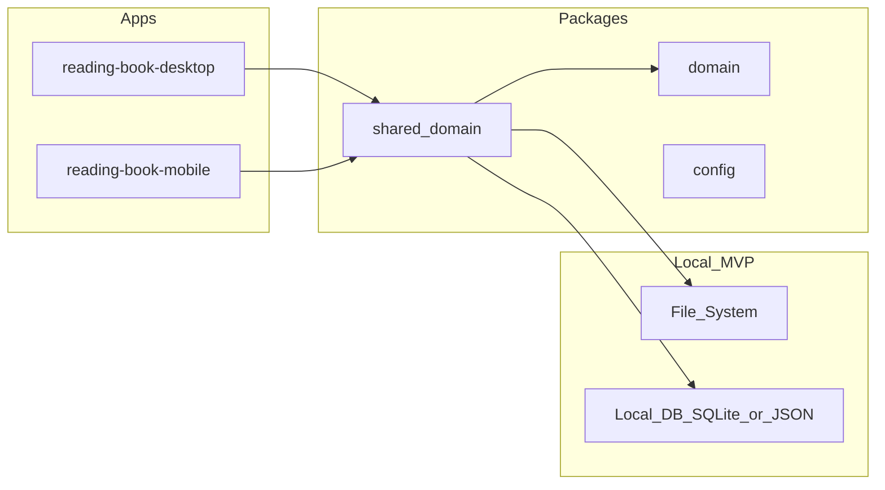

# 02 — Thiết kế (Design)


## Mục lục

- [1. Nguyên tắc thiết kế (không đàm phán)](#1-nguyên-tắc-thiết-kế-không-đàm-phán)
  - [Don'ts (bắt buộc ghi trong SDS)](#donts-bắt-buộc-ghi-trong-sds)
- [2. Information Architecture (MVP)](#2-information-architecture-mvp)
  - [Màn hình MVP](#màn-hình-mvp)
- [3. Reader interaction model](#3-reader-interaction-model)
- [4. Design tokens (implement)](#4-design-tokens-implement)
- [5. Domain model (shared)](#5-domain-model-shared)
- [6. Kiến trúc kỹ thuật đề xuất](#6-kiến-trúc-kỹ-thuật-đề-xuất)
  - [Desktop (Phase 1 primary)](#desktop-phase-1-primary)
  - [Mobile (sau MVP desktop ổn)](#mobile-sau-mvp-desktop-ổn)
  - [Phase 2 AI](#phase-2-ai)
  - [Phase 3 Linked libraries](#phase-3-linked-libraries)
- [7. Nội dung cần có trong SDS.md](#7-nội-dung-cần-có-trong-sdsmd)
- [8. Quyết định cần chốt khi viết SDS (đề xuất mặc định)](#8-quyết-định-cần-chốt-khi-viết-sds-đề-xuất-mặc-định)

---

Mục tiêu: biến SRS + Design System thành [`docs/software/SDS.md`](../software/SDS.md), information architecture, và contract cho `source/packages/`.

## 1. Nguyên tắc thiết kế (không đàm phán)

Từ [Reading_App_Design_System.md](../reading-habbit/Reading_App_Design_System.md) và [UX_of_Reading.md](../reading-habbit/UX_of_Reading.md):

1. **Content-first** — nội dung là nhân vật chính  
2. **Invisible UI** — chrome chỉ hiện khi cần  
3. **Visual comfort** — cream / sepia / dark; accent `#4A90E2`  
4. **Control** — typography & theme do user quyết định  
5. **Invisible Assistance** — AI là floating affordance nhỏ, không tự ý  

### Don'ts (bắt buộc ghi trong SDS)

- Không neon / animation gây xao nhãng  
- Không popup giữa reader  
- Không chồng nhiều lớp UI che nội dung  
- Không card-heavy trong màn đọc  

## 2. Information Architecture (MVP)



### Màn hình MVP

| Screen | Mục đích duy nhất | Ghi chú UX |
| :--- | :--- | :--- |
| Library | Chọn sách / tiếp tục đọc | Không dashboard stats |
| Reader | Đọc + highlight/note | Full-bleed content; chrome ẩn |
| Highlights & Notes | Ôn lại dấu ấn | List theo thời gian / vị trí |
| Reading Settings | Font, size, theme, line-height | Persist ngay |
| Import | Thêm file vào thư viện | Flow ngắn |

Phase 2 thêm: AI panel (slide-over), Flashcards, Search.  
Phase 3 thêm: Linked libraries (Drive / Books / Apple Books), Stats, Tags, Knowledge links.

## 3. Reader interaction model

| Gesture / action | Kết quả |
| :--- | :--- |
| Tap cạnh trái/phải (hoặc scroll) | Lật / chuyển trang |
| Tap giữa | Toggle chrome (toolbar + progress) |
| Select text | Context menu: Highlight, Note, (Phase 2: Ask AI) |
| Long-press | Context menu tương đương |
| Floating AI (Phase 2) | Mở panel; không auto-run |

Progress: thanh mỏng đáy màn hình, luôn tinh tế (không chiếm attention).

## 4. Design tokens (implement)

Đưa vào shared theme package (desktop CSS variables; mobile theme object):

| Token | Light | Sepia | Dark |
| :--- | :--- | :--- | :--- |
| `--bg` | `#FDFBF7` | `#F4ECD8` | `#1A1A1A` |
| `--text` | `#2D2D2D` | `#2D2D2D` | gần trắng dịu |
| `--accent` | `#4A90E2` | `#4A90E2` | `#4A90E2` |

Typography:

- Body (reader): Literata / Merriweather / Playfair — serif  
- UI chrome: Inter / system sans  
- Line-height: 1.5–1.7  
- Measure: max-width nội dung ~600–750px  
- Side padding ≥ 40px (desktop)

## 5. Domain model (shared)

Đặt domain models/services trong `source/packages/domain` và `source/packages/shared`:

```text
Library
  └── Book { id, title, authors[], format, path, cover?, addedAt }
Collection { id, name, description?, createdAt, updatedAt }
CollectionBook { collectionId, bookId, sortOrder, addedAt }   # Book ↔ Collection n-n
ReadingSessionState { bookId, location, percent, updatedAt }
Highlight { id, bookId, locationRange, color, text, createdAt }
Note { id, bookId, highlightId?, location, body, createdAt, updatedAt }
ReadingPreferences { theme, fontFamily, fontSize, lineHeight }
```

Phase 2 bổ sung: `Flashcard`, `ReviewSchedule`, `AiSession`.  
Phase 3 bổ sung: `SyncCursor`, `Tag` (auto-tag), `KnowledgeLink`, `ReadingSessionStat`, smart collections.

## 6. Kiến trúc kỹ thuật đề xuất



### Desktop (Phase 1 primary)

- Electron main: file import, secure path, window  
- Preload bridge: IPC hẹp  
- Renderer: React reader UI  
- Local persistence: SQLite (khuyến nghị) hoặc structured JSON + file assets  

### Mobile (sau MVP desktop ổn)

- Expo Router screens map cùng IA  
- Cùng domain models (`packages/domain`); adapter storage riêng  

### Phase 2 AI

- Adapter `AiProvider` (API key / local model)  
- Chunking + embeddings per book (local index hoặc server)  
- UI: selection → Ask; panel không block scroll reader  

### Phase 3 Linked libraries

- `ExternalLibraryConnector` (Google Drive / Google Books / Apple Books)  
- **Không** Auth/account / OAuth2 đăng nhập app  
- Catalog pull → import local; unlink không wipe data  

## 7. Nội dung cần có trong SDS.md

1. Mục tiêu kiến trúc & ràng buộc  
2. Sơ đồ component / package  
3. Data model + persistence  
4. IPC / API boundaries (Electron)  
5. Reader rendering strategy (EPUB engine lựa chọn)  
6. Security: path sandbox, không arbitrary remote code  
7. Theme / design token mapping  
8. Extension points cho AI & Linked libraries (interfaces, chưa implement)  
9. Quyết định kỹ thuật đã chốt (engine, DB, state library)

## 8. Quyết định cần chốt khi viết SDS (đề xuất mặc định)

| Chủ đề | Đề xuất mặc định |
| :--- | :--- |
| EPUB engine (web/desktop) | epub.js hoặc tương đương trên Chromium |
| Local DB | SQLite qua better-sqlite3 (main) hoặc sql.js |
| State UI | Zustand hoặc React context tối giản |
| Highlight storage | Offset / CFI (EPUB) trong DB |
| AI (Phase 2) | Remote LLM + RAG local index trước; on-device sau |
| Linked libraries (Phase 3) | Folder/path connectors (Drive Desktop, Books library); không OAuth2 identity app |

Ghi các quyết định này vào SDS; không để “TBD” khi bắt đầu code Phase 1.
