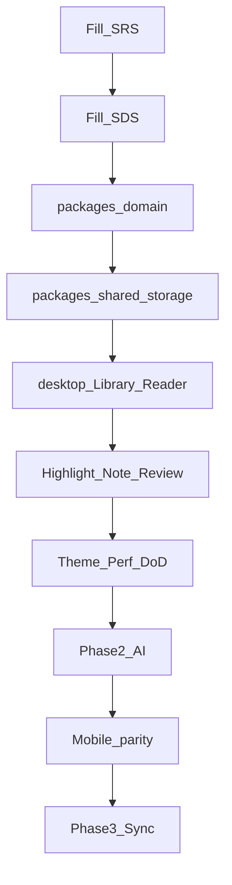

# 03 — Triển khai (Implementation)


## Mục lục

- [1. Cấu trúc repo liên quan](#1-cấu-trúc-repo-liên-quan)
- [2. Thứ tự làm việc tổng quát](#2-thứ-tự-làm-việc-tổng-quát)
- [3. Workstreams kỹ thuật](#3-workstreams-kỹ-thuật)
- [4. Definition of Done — mỗi feature](#4-definition-of-done--mỗi-feature)
- [5. Checklist triển khai theo phase](#5-checklist-triển-khai-theo-phase)
- [6. Kiểm thử tối thiểu](#6-kiểm-thử-tối-thiểu)
  - [Phase 1](#phase-1)
  - [Phase 2](#phase-2)
  - [Phase 3](#phase-3)
- [7. Công cụ & lệnh hiện có](#7-công-cụ--lệnh-hiện-có)
- [8. Quy ước khi code](#8-quy-ước-khi-code)

---

Mục tiêu: biến SRS/SDS thành code trong monorepo, theo phase, có Definition of Done rõ.

## 1. Cấu trúc repo liên quan

```text
docs/
  reading-habbit/     # research (đã có)
  plan/               # plan (thư mục này)
  software/           # SRS.md, SDS.md (điền từ plan)
source/
  apps/
    reading-book-desktop/   # Phase 1 primary
    reading-book-mobile/    # sau MVP desktop
  packages/
    domain/                 # domain models + ports
    shared/                 # application use cases
    config/                 # shared config
```

## 2. Thứ tự làm việc tổng quát



Mobile có thể bắt đầu song song **sau khi** domain + desktop reader ổn định (tránh 2 UI diverging trước khi model chốt).

## 3. Workstreams kỹ thuật

| Workstream | Việc chính | Owner gợi ý |
| :--- | :--- | :--- |
| Docs | SRS, SDS, acceptance | Product / you + AI |
| Domain | models, repositories, session/highlight APIs | domain + shared packages |
| Reader | EPUB render, gestures, settings | desktop app |
| Library | import, list, continue | desktop app |
| Knowledge | highlights list, notes CRUD | shared + UI |
| AI | provider, RAG, flashcards | Phase 2 |
| Linked libraries | ExternalLibraryConnector (Drive / Books / Apple Books); không account | Phase 3 |
| Mobile | Expo screens parity | sau Phase 1 |

## 4. Definition of Done — mỗi feature

- [ ] Có FR-id trong SRS  
- [ ] UI tuân Design System don'ts  
- [ ] Dữ liệu persist qua restart app  
- [ ] Không phá flow đọc (không popup, không jank rõ)  
- [ ] Manual test steps ghi trong PR / checklist phase  
- [ ] Types shared nếu logic dùng ở &gt; 1 app  

## 5. Checklist triển khai theo phase

Chi tiết:

- [04_Phase_MVP_Free_Core.md](./04_Phase_MVP_Free_Core.md)
- [05_Phase_Premium_AI.md](./05_Phase_Premium_AI.md)
- [06_Phase_Special_Sync.md](./06_Phase_Special_Sync.md)

## 6. Kiểm thử tối thiểu

### Phase 1

- Import EPUB → hiện trong Library  
- Mở sách → đổi theme/font → không mất vị trí  
- Đọc → đóng app → mở lại đúng location  
- Highlight + note → thấy ở Review screen  
- Continue Reading mở đúng sách gần nhất  

### Phase 2

- Select đoạn → Ask AI → trả lời có căn cứ đoạn  
- Semantic search tìm đúng đoạn khái niệm  
- Flashcard tạo từ highlight → review schedule cập nhật  

### Phase 3

- Link Drive / Books / Apple Books → list tài liệu → import local  
- Auto-tag chỉ chạy khi opt-in  
- Special user: không ads mọi màn  

## 7. Công cụ & lệnh hiện có

Desktop:

```bash
cd source/apps/reading-book-desktop
npm install
npm run dev
```

Mobile:

```bash
cd source/apps/reading-book-mobile
npm install
npm run start
```

## 8. Quy ước khi code

- Không thêm AI / linked libraries vào Phase 1 “cho tiện”  
- Prefer mở rộng `packages/shared` thay vì copy logic giữa apps  
- Reader UI: chrome ẩn mặc định  
- Mọi upsell/ads nằm ngoài vùng nội dung đang đọc (theo SRS monetization)
