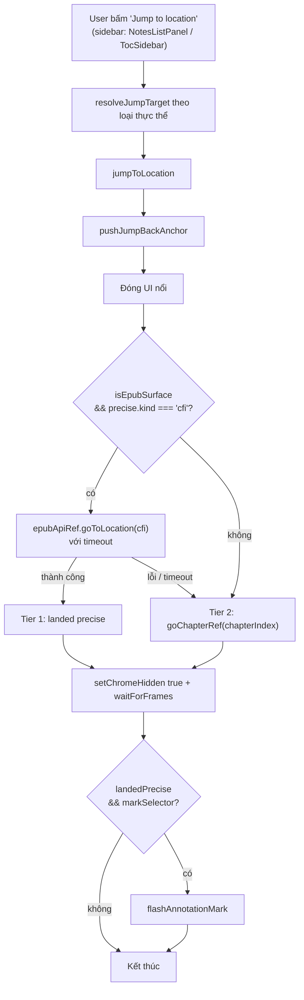

# Spec: Jump to Location hợp nhất cho mọi loại Annotation

Trạng thái: Draft — chờ review kỹ thuật trước khi lên task breakdown.
Phạm vi: `reading-book-desktop` (Electron/React), bề mặt đọc EPUB (bề mặt thật duy nhất hiện có).
Tài liệu liên quan: [`docs/error/jump-to-location.md`](../error/jump-to-location.md) (mô tả cơ chế hiện trạng — nhiều đoạn trong đó đã lỗi thời so với code, xem mục 1).

---

## 1. Bối cảnh & vấn đề

Ứng dụng hiện có **4 hàm "jump" độc lập**, viết tay riêng lẻ, sống trong
`useReaderAnnotations.ts`:

| Hàm | Gọi từ | Cách nhảy hiện tại |
|---|---|---|
| `jumpToHighlight(h)` | `NotesListPanel` → `onJumpHighlight` | Luôn nhảy **thô theo chương** (`goChapterRef`) — CFI đã bị gỡ, xem comment tại chỗ khai báo hàm |
| `jumpToBookmark(bookmark)` | `TocSidebar` (tab bookmark) → `onJumpBookmark` | Nhảy **chính xác bằng CFI** nếu `locationRef` là `CfiLocation` (qua `epubApiRef.goToLocation`), fallback chương nếu không |
| `jumpToTypewriterNote(note)` | `NotesListPanel` → `onJumpTypewriterNote` | Luôn nhảy **thô theo trang/chương** — CFI cũng đã bị gỡ |
| `jumpToFreehandStroke(stroke)` | `NotesListPanel` → `onJumpPencilStroke` | Luôn nhảy **thô theo trang** — freehand chưa từng có CFI |

Ba vấn đề chính:

1. **Không nhất quán**: mỗi hàm tự quyết định thứ tự các bước (khi nào `setChromeHidden(true)`,
   có flash hay không, có "màn che" `isJumping...` hay không), tự lặp lại logic đóng UI nổi
   (`clearHighlightHandles`, `closeSelectionMenu`, `blurReaderSidebarFocus`).
2. **Thụt lùi về độ chính xác**: `jumpToHighlight`/`jumpToTypewriterNote` từng nhảy bằng CFI
   nhưng bị gỡ vì bug `IndexSizeError`/mis-locate của epub.js `locationOf` (xem
   `docs/error/jump-to-location.md` §3.6). Trong khi đó, `EpubjsHandle.goToLocation()`
   (`openEpubjs.ts`) **đã có sẵn cơ chế sửa lỗi này** — `overlayPainter.suspend()` +
   `overlayPainter.clear()` trước khi `display()`, cộng "trick" gọi `display()` hai lần để chờ
   layout ổn định — và cơ chế này vẫn đang chạy tốt cho `jumpToBookmark` ngày hôm nay. Nói cách
   khác: **hạ tầng CFI đáng tin cậy đã tồn tại, chỉ là 3/4 loại annotation không dùng nó.**
3. **Không tổng quát**: `AnnotationType` trong domain model đã định nghĩa 6 loại
   (`highlight | underline | strikethrough | freehand | textbox | stamp`) nhưng UI mới có 3 loại
   thật (highlight, textbox/typewriter, freehand); `underline`/`strikethrough`/`stamp` chỉ tồn
   tại ở tầng schema. Khi các loại này được implement, chúng sẽ cần "jump" — nhưng không có chỗ
   nào để cắm vào vì logic jump hiện tại được viết cứng theo từng loại, không theo một interface
   chung.

Mục tiêu của spec này là thay 4 hàm rời rạc bằng **một pipeline `jumpToLocation()` duy nhất**,
nhận một `JumpTarget` tổng quát cho *bất kỳ* annotation/bookmark nào, tự quyết định tier chính
xác nào khả dụng, và chạy đúng một luồng UX nhất quán.

## 2. Quyết định kiến trúc đã chốt

Xác nhận với chủ dự án trước khi viết spec:

| Quyết định | Lựa chọn |
|---|---|
| Độ chính xác | **Kiến trúc phân tầng**: thử CFI chính xác trước (Tier 1); nếu không có CFI, hoặc decode/display lỗi/timeout → tự động fallback về chương/trang (Tier 2). Không bao giờ throw ra UI. |
| Phạm vi loại | **Gộp luôn Bookmark** vào cùng cơ chế `jumpToLocation()` — dùng chung 1 interface `JumpTarget` cho cả 6 loại annotation lẫn bookmark, dù bookmark nằm ở bảng SQLite riêng (`bookmarks`, không phải `annotations`). |
| Điểm vào (entry points) | **Chỉ trong Reader sidebar hiện có** (`NotesListPanel`, `TocSidebar`). Không mở rộng sang tìm kiếm trong sách (search vẫn "coming soon"), không mở rộng sang deep-link từ Library. |
| UX khi đến nơi | **Cả hai**: (a) hiệu ứng flash/highlight tại đúng annotation vừa nhảy tới, và (b) một affordance "quay lại vị trí đọc trước khi nhảy" (jump-back), phạm vi 1 cấp (không phải multi-level undo). |

### Non-goals (ngoài phạm vi spec này)

- Renderer PDF/TXT/MD/DOCX thật — hiện chỉ có bề mặt "fake chapter" demo (`FAKE_CHAPTERS`) cho
  mọi định dạng ngoài EPUB; spec này thiết kế interface tổng quát đủ để renderer tương lai cắm
  CFI-tương-đương (page-rect) vào Tier 1 mà không đổi contract, nhưng **không** implement điều đó.
- Nhảy tới kết quả tìm kiếm trong sách.
- Deep-link "mở sách từ Library rồi nhảy thẳng tới 1 annotation".
- Lịch sử điều hướng nhiều cấp (multi-level back/forward) — chỉ 1 cấp "quay lại nơi vừa rời đi".
- Implement UI tạo mới cho `underline`/`strikethrough`/`stamp` — spec chỉ đảm bảo khi các loại
  này được xây, chúng **tự động** có jump hoạt động vì đi qua cùng resolver tổng quát.

## 3. User Stories

**US-1 — Nhảy nhất quán tới mọi loại annotation**
Là người đọc, khi tôi bấm "Jump to location" trên một highlight, underline, strikethrough, nét vẽ
tay, ghi chú, con dấu, hoặc bookmark trong sidebar, tôi muốn ứng dụng đưa tôi đến đúng vị trí đó
trong sách với cùng một trải nghiệm (cùng hiệu ứng che màn hình, cùng animation xác nhận), bất kể
loại đánh dấu là gì.

**US-2 — Độ chính xác cao nhất có thể, không bao giờ crash**
Là người đọc, khi annotation của tôi có vị trí chính xác trong văn bản (CFI), tôi muốn được nhảy
thẳng tới đúng câu/đoạn đó (không chỉ đầu chương). Khi vị trí chính xác không khả dụng (annotation
cũ, nội dung "fake chapter", hoặc lỗi kỹ thuật), tôi muốn được đưa tới đúng chương/trang gần nhất
thay vì thấy lỗi hoặc màn hình treo.

**US-3 — Biết mình vừa nhảy tới đâu**
Là người đọc, sau khi nhảy, tôi muốn thấy một hiệu ứng nhấp nháy ngắn quanh đúng annotation đó (khi
annotation được render inline trong nội dung), để tôi không phải dò tìm lại bằng mắt.

**US-4 — Quay lại chỗ đang đọc dở**
Là người đọc, sau khi nhảy tới một annotation ở xa vị trí hiện tại, tôi muốn có một nút/affordance
"Quay lại vị trí trước đó" để trở về đúng chỗ tôi đang đọc dở trước khi bấm jump, mà không phải tự
cuộn tìm lại.

**US-5 — Annotation tương lai tự động có jump**
Là lập trình viên bảo trì app, khi tôi thêm UI cho `underline`, `strikethrough`, hoặc `stamp`, tôi
không muốn phải viết thêm một hàm `jumpToXxx` mới — tôi chỉ cần đưa annotation qua resolver chung
và mọi thứ (tier CFI/fallback, flash, jump-back) tự hoạt động.

## 4. Kiến trúc

### 4.1 Trừu tượng hoá: `JumpTarget`

File mới: `packages/shared/models/jump-target.ts` (platform-agnostic, cùng tầng với
`bookmark-persistence.ts`/`highlight-persistence.ts`).

```ts
export type JumpEntityKind = 'annotation' | 'bookmark'

/** Vị trí chính xác, tier ưu tiên cao nhất khi khả dụng. */
export type PreciseLocator =
  | { kind: 'cfi'; cfi: string }
  // Sẵn chỗ cho renderer PDF tương lai — chưa có adapter nào tạo ra giá trị này hôm nay.
  | { kind: 'page-rect'; page: number; rect?: { x: number; y: number; width: number; height: number } }

/**
 * Input tổng quát cho `jumpToLocation()`. Được dựng bởi 1 resolver riêng cho mỗi
 * loại thực thể (annotation theo `type`, hoặc bookmark) — xem 4.2.
 */
export interface JumpTarget {
  /** id của annotation/bookmark — dùng làm selector flash + để không log lặp. */
  id: string
  entityKind: JumpEntityKind
  /** Chỉ có khi entityKind === 'annotation'. */
  annotationType?: import('@reading-book/domain').AnnotationType
  /** Tier 2 — luôn có giá trị, kể cả khi Tier 1 khả dụng (dùng làm fallback). */
  chapterIndex: number
  /** Tier 1 — undefined nghĩa là thực thể này chưa từng có vị trí chính xác (vd freehand hôm nay). */
  precise?: PreciseLocator
  /** CSS selector của DOM mark inline, nếu loại này được vẽ trực tiếp trong nội dung. undefined = không flash (vd bookmark). */
  markSelector?: string
}
```

### 4.2 Resolver theo từng loại (giữ nguyên chỗ ở, chỉ đổi output)

Các hàm persistence **đã tồn tại** hôm nay (`epubJumpCfi`, `readerBookmarkJumpLocation`,
`parseTypewriterLocation`, `readerFreehandPageNumber`, `chapterIndexFromAnnotationDto`) chỉ cần
một lớp bọc mỏng để trả về `JumpTarget` thay vì trả `Location`/CFI thô riêng lẻ như hiện tại.
Không cần viết lại logic parse vị trí đã có.

```ts
// packages/shared/models/jump-target.ts (tiếp)

export function highlightJumpTarget(h: ReaderHighlight): JumpTarget {
  const base = {
    id: h.id,
    entityKind: 'annotation' as const,
    annotationType: 'highlight' as const,
    chapterIndex: h.chapterIndex,
    markSelector: `[data-rb-hl-id="${h.id}"]`,
  }
  if (h.source === 'epub') {
    const cfi = epubJumpCfi(h) // locationStart || cfiRange — hàm đã có
    return cfi ? { ...base, precise: { kind: 'cfi', cfi } } : base
  }
  return base // 'fake' surface — không có CFI, luôn Tier 2
}

export function bookmarkJumpTarget(b: ReaderBookmark): JumpTarget {
  const location = readerBookmarkJumpLocation(b) // hàm đã có, trả Location | undefined
  const base = {
    id: b.id,
    entityKind: 'bookmark' as const,
    chapterIndex: b.chapterIndex,
    markSelector: undefined, // bookmark không có DOM mark inline — xem 4.5
  }
  return location instanceof CfiLocation
    ? { ...base, precise: { kind: 'cfi', cfi: location.cfi } }
    : base
}

export function typewriterJumpTarget(note: ReaderTypewriterNote): JumpTarget {
  const base = {
    id: note.id,
    entityKind: 'annotation' as const,
    annotationType: 'textbox' as const,
    chapterIndex: note.chapterIndex,
    markSelector: `[data-rb-tw-note="${note.id}"]`,
  }
  const loc = parseTypewriterLocation(note.positionData) // hàm đã có
  if (loc?.anchor === 'cfi-offset') return { ...base, precise: { kind: 'cfi', cfi: loc.cfi } }
  return base // fake-pct / page-rect / legacy-pct — Tier 2 hôm nay
}

export function freehandJumpTarget(stroke: ReaderShapeAnnotation): JumpTarget {
  // Freehand chưa từng gắn CFI (chỉ điểm % tương đối trong 1 trang) — luôn Tier 2.
  // Giữ nguyên hành vi hôm nay, chỉ đổi shape trả về.
  return {
    id: stroke.id,
    entityKind: 'annotation',
    annotationType: 'freehand',
    chapterIndex: stroke.chapterIndex,
    markSelector: `[data-rb-ink-stroke="${stroke.id}"]`,
  }
}

// underline/strikethrough: dùng chung shape với highlight (Annotation.isTextRangeType()
// đã coi 3 loại này là "text-range types" ở tầng domain — packLocation/unpackLocation
// giống hệt nhau). Khi UI được xây, thêm underlineJumpTarget/strikethroughJumpTarget
// bằng cách copy highlightJumpTarget và đổi annotationType + markSelector.

// stamp: chưa rõ vị trí sẽ neo theo gì (nhiều khả năng page-rect như freehand khi implement).
// Để trống resolver tới khi UI tạo stamp tồn tại — jumpToLocation() vẫn xử lý an toàn nhờ
// `precise` optional.
```

### 4.3 Orchestrator hợp nhất: `jumpToLocation()`

File mới: `src/screens/Reader/logic/hooks/useReaderJump.ts` — thay thế
`jumpToHighlight`/`jumpToBookmark`/`jumpToTypewriterNote`/`jumpToFreehandStroke` bên trong
`useReaderAnnotations.ts` bằng cách gọi hook này. Các 4 hàm cũ trở thành wrapper 1 dòng gọi
`jumpToLocation(highlightJumpTarget(h))` v.v. để không phải sửa toàn bộ chữ ký props đang truyền
xuống `ReaderScreen.tsx`/`NotesListPanel.tsx` trong lần đầu (giảm diff, xem §7).

```ts
const CFI_JUMP_TIMEOUT_MS = 1500   // đủ cho waitForSectionResources (tối đa 1200ms) + 2*waitForFrames
const JUMP_FLASH_MS = 900          // giữ nguyên hằng số cũ trong docs/error/jump-to-location.md
const JUMP_MARK_POLL_MS = 40
const JUMP_MARK_TIMEOUT_MS = 900

async function jumpToLocation(target: JumpTarget): Promise<void> {
  // 1. Chụp lại vị trí hiện tại CHO jump-back, trước khi làm bất cứ điều gì khác (US-4).
  pushJumpBackAnchor(captureCurrentAnchor())

  // 2. Dọn UI nổi — logic dùng chung, gộp 3 lệnh gọi từng bị lặp lại ở cả 4 hàm cũ.
  closeFloatingUiForJump() // clearHighlightHandles + closeSelectionMenu + blurReaderSidebarFocus

  setIsJumpingToAnnotation(true)
  let landedPrecise = false
  try {
    if (isEpubSurface && target.precise?.kind === 'cfi') {
      try {
        await withTimeout(
          epubApiRef.current!.goToLocation(new CfiLocation(target.precise.cfi)),
          CFI_JUMP_TIMEOUT_MS,
        )
        landedPrecise = true
      } catch (err) {
        // Tier 1 thất bại (CFI hỏng, section không load kịp, timeout) — rơi xuống Tier 2,
        // không throw ra UI. Log để theo dõi tần suất fallback (xem §8, mục theo dõi).
        console.warn('[jump] CFI tier failed, falling back to chapter', target.id, err)
      }
    }
    if (!landedPrecise) {
      // Tier 2 — luôn thành công vì chapterIndex luôn có giá trị hợp lệ (clamp trong goChapter).
      goChapterRef.current(target.chapterIndex)
    }

    setChromeHidden(true)
    await waitForFrames(2)

    if (landedPrecise && target.markSelector) {
      void flashAnnotationMark(target.markSelector) // fire-and-forget, xem 4.4
    }
  } finally {
    setIsJumpingToAnnotation(false)
  }
}
```

Sơ đồ luồng:



### 4.4 Hiệu ứng flash (US-3)

Tái sử dụng nguyên bộ ba hàm mô tả trong `docs/error/jump-to-location.md` §3.5
(`findAnnotationMarkElement` / `waitForAnnotationMarkElement` / `flashAnnotationMark`) — hiện
những hàm này **không còn tồn tại trong code** (đã bị gỡ cùng lúc với CFI jump của highlight),
nên cần viết lại từ mô tả trong doc, đặt tại `src/reader/overlays/annotation-flash.ts`:

- `findAnnotationMarkElement(selector)`: thử `document.querySelector` trước, sau đó duyệt từng
  `<iframe>` (`iframe.contentDocument?.querySelector`) — vì nội dung EPUB nằm trong iframe.
- `waitForAnnotationMarkElement(selector)`: poll mỗi `JUMP_MARK_POLL_MS` (40ms), tối đa
  `JUMP_MARK_TIMEOUT_MS` (900ms) — vì `<mark>`/layer được `overlayPainter.resume()` vẽ lại bất
  đồng bộ sau khi `goToLocation` resolve. Không tìm thấy → trả `null`, **im lặng**, không toast
  lỗi (annotation vẫn đúng chương/trang, chỉ là không có hiệu ứng xác nhận).
- `flashAnnotationMark(selector)`: dùng Web Animations API (`el.animate(...)`) trực tiếp trên
  element tìm được — không thêm CSS class (vì element có thể nằm trong iframe khác document,
  không tiện inject stylesheet). Viền hổ phách `rgba(245, 158, 11, 0.95)` fade in → giữ có
  `filter: brightness` nhấp nháy → fade out, tổng `JUMP_FLASH_MS` (900ms).

**Chỉ chạy flash khi `landedPrecise === true`.** Khi rơi về Tier 2 (chương/trang), không có DOM
mark chính xác nào để flash vào — annotation có thể ở bất kỳ đâu trong chương đích.

### 4.5 Trường hợp Bookmark không có DOM mark

Bookmark không được vẽ như một `<mark>`/layer trong nội dung (`markSelector: undefined`), nên
"flash" không áp dụng. Giữ nguyên affordance hiện có: `justJumpedBookmarkId` — sidebar coi bookmark
vừa nhảy tới là "đang ở đây" trong ~2000ms (dài hơn vì chế độ scroll liên tục của epub.js có thể
còn chỉnh lại vị trí cuộn vài trăm ms sau khi `display()` resolve), rồi nhường lại cho logic hình
học thật (`isCfiWithinCurrentView`). Cơ chế này nằm ngoài `jumpToLocation()` — do component gọi
`jumpToLocation` set state riêng, `jumpToLocation` không cần biết về nó.

### 4.6 Jump-back / "Quay lại vị trí trước đó" (US-4)

State **chỉ tồn tại trong phiên đọc** (React state, không persist SQLite) — đây là tiện ích điều
hướng tức thời, không phải lịch sử đọc dài hạn (đã có `reading_session_states` lo việc đó).

```ts
type JumpBackAnchor =
  | { surface: 'epub'; cfi: string }
  | { surface: 'fake'; chapterIndex: number }

function captureCurrentAnchor(): JumpBackAnchor {
  if (isEpubSurface) {
    const cfi = epubApiRef.current?.getCurrentLocation()?.cfi
    if (cfi) return { surface: 'epub', cfi }
  }
  return { surface: 'fake', chapterIndex }
}
```

- `pushJumpBackAnchor` ghi đè slot duy nhất (1 cấp, theo quyết định §2) — **không** đẩy chồng nếu
  người dùng jump nhiều lần liên tiếp; slot luôn giữ vị trí *trước cú jump gần nhất*, không phải
  toàn bộ chuỗi.
- Một jump-back KHÔNG tự ghi thêm anchor mới (tránh vòng lặp back↔forth vô hạn tạo history rác).
- Slot bị xoá (set `undefined`) khi: người dùng tự điều hướng thủ công (lật trang, chọn TOC, cuộn
  tay) sau cú jump — vì lúc đó "quay lại" không còn ý nghĩa rõ ràng; hoặc khi đổi sách
  (`bookId` effect reset, giống các state khác trong `useReaderNavigation`).
- UI: một affordance nhỏ, ví dụ pill "← Quay lại vị trí đang đọc" xuất hiện góc dưới màn đọc trong
  ~5–8 giây sau mỗi jump thành công (ẩn khi hết giờ hoặc khi bấm), không phải nút cố định tồn tại
  vĩnh viễn trên toolbar (tránh chiếm chỗ khi không dùng tới).
- `jumpBack()` tái sử dụng chính `jumpToLocation()`: dựng lại một `JumpTarget` giả
  (`entityKind` không quan trọng ở đây, có thể thêm biến thể nội bộ `entityKind: 'jump-back'`)
  từ anchor đã lưu, rồi gọi cùng orchestrator — nghĩa là "quay lại" **cũng** được hưởng cùng
  tier CFI-trước/fallback-sau, cùng chrome-hide, không cần logic riêng.

### 4.7 Vì sao tin tưởng Tier 1 (CFI) sẽ ổn định hơn lần trước

Ghi chú kiến trúc quan trọng cho người triển khai: comment gỡ bỏ CFI ở `jumpToHighlight` /
`jumpToTypewriterNote` trỏ về `docs/error/jump-to-location.md`, nhưng cơ chế `goToLocation()` mà
tài liệu đó mô tả như "cách sửa" (`overlayPainter.suspend()` + `clear()` trước `display()`, gọi
`display()` hai lần để chờ layout ổn định — `openEpubjs.ts` dòng ~1866–1908) **đã nằm sẵn trong
code và đang chạy production cho `jumpToBookmark` mà không có báo lỗi mới**. Nhiều khả năng việc
gỡ CFI khỏi highlight/typewriter xảy ra ở một thời điểm mà fix này chưa tồn tại hoặc chưa đủ, và
không ai quay lại bật CFI cho 2 loại đó sau khi fix landed.

→ **Khuyến nghị**: trước khi code Tier 1 cho toàn bộ loại, làm một spike thủ công — tạm sửa
`jumpToHighlight` để gọi `epubApiRef.goToLocation(new CfiLocation(epubJumpCfi(h)))` (dùng lại
đúng cơ chế đã có), thử với ≥20 highlight trên nhiều EPUB khác nhau (đặc biệt sách có ảnh/CSS
phức tạp — nguồn gốc bug cũ là ảnh làm lệch layout), xác nhận không còn `IndexSizeError`/nhảy sai
trước khi coi Tier 1 là "an toàn". Tier 2 fallback vẫn là lưới an toàn cuối cùng dù spike có phát
hiện case nào đó vẫn lỗi.

## 5. Database Schema

**Không cần migration mới.** Toàn bộ dữ liệu vị trí `jumpToLocation()` cần đã tồn tại sẵn trong
schema hiện tại:

| Bảng | Cột liên quan | Vai trò cho jump |
|---|---|---|
| `annotations` (migration 016, hiện hành) | `location_data` (opaque theo `type`), `page_number` (nullable) | Nguồn cho `precise` (CFI/cfi-offset khi có) và `chapterIndex` fallback qua `chapterIndexFromAnnotationDto(page_number, cfi?)` — hàm này **đã tổng quát theo mọi type**, không cần sửa. |
| `bookmarks` (migration 001 + 015) | `location_ref` (Location JSON, có thể embed `chapterIndex`) | Nguồn cho `precise`/`chapterIndex` qua `readerBookmarkJumpLocation` — đã có. |

Tham khảo nhanh cấu trúc `annotations` hiện hành (không đổi):

```sql
CREATE TABLE annotations (
  id                TEXT    PRIMARY KEY NOT NULL,
  book_id           TEXT    NOT NULL,
  page_number       INTEGER,                 -- NULL cho EPUB (CFI là nguồn sự thật)
  type              TEXT    NOT NULL
    CHECK (type IN ('highlight','underline','strikethrough','freehand','textbox','stamp')),
  location_data     TEXT    NOT NULL,         -- opaque, parse theo `type`
  content           TEXT,
  notes             TEXT,
  style_properties  TEXT    NOT NULL DEFAULT '{}',
  status            TEXT    NOT NULL DEFAULT 'None',
  is_checked        INTEGER NOT NULL DEFAULT 0,
  created_at        TEXT    NOT NULL,
  updated_at        TEXT    NOT NULL,
  FOREIGN KEY (book_id) REFERENCES books (id) ON DELETE CASCADE
);
```

State cho jump-back (§4.6) và trạng thái "đang che màn hình khi jump" (`isJumpingToAnnotation`) là
**in-memory React state**, không có bảng nào lưu — mất khi đóng sách/tắt app, đúng ý đồ (đây là
tiện ích điều hướng tức thời trong 1 phiên đọc, không phải lịch sử lâu dài).

Nếu về sau muốn "lịch sử jump nhiều cấp, tồn tại qua các lần mở app" (ngoài phạm vi spec này —
xem Non-goals), đó sẽ là bảng mới kiểu `jump_history(book_id, anchor_json, created_at)` — không
thiết kế ở đây vì chưa được yêu cầu.

## 6. API / Logic luồng dữ liệu

Đây là app desktop Electron — không có REST/GraphQL API; "API" ở đây là (a) các hàm
TypeScript nội bộ mới/sửa và (b) xác nhận **không cần thêm IPC channel nào** vì `jumpToLocation()`
chỉ vận hành trên dữ liệu đã có sẵn trong renderer state (danh sách highlights/bookmarks/notes đã
tải qua `OverlayChannels` từ trước khi người dùng bấm "Jump").

### 6.1 File mới

| File | Export chính |
|---|---|
| `packages/shared/models/jump-target.ts` | `JumpTarget`, `PreciseLocator`, `highlightJumpTarget`, `bookmarkJumpTarget`, `typewriterJumpTarget`, `freehandJumpTarget` |
| `src/reader/overlays/annotation-flash.ts` | `findAnnotationMarkElement`, `waitForAnnotationMarkElement`, `flashAnnotationMark` |
| `src/screens/Reader/logic/hooks/useReaderJump.ts` | Hook `useReaderJump({ epubApiRef, isEpubSurface, chapterIndex, goChapterRef, setChromeHidden, setIsJumpingToAnnotation, closeFloatingUiForJump })` → trả `{ jumpToLocation, jumpBack, canJumpBack }` |

### 6.2 File sửa

| File | Thay đổi |
|---|---|
| `useReaderAnnotations.ts` | Gọi `useReaderJump(...)`; 4 hàm `jumpToHighlight/jumpToBookmark/jumpToTypewriterNote/jumpToFreehandStroke` trở thành wrapper 1 dòng gọi `jumpToLocation(xxxJumpTarget(entity))` — giữ nguyên chữ ký cũ nên **không đổi props** truyền xuống `ReaderScreen.tsx`. |
| `ReaderScreen.tsx` | Thêm render 1 component nhỏ hiển thị pill "Quay lại vị trí đang đọc" khi `canJumpBack === true`, gọi `annotations.jumpBack` khi bấm. |
| `NotesListPanel.tsx` | Không đổi — `AnnotationContextMenu`'s "Jump to location" đã gọi `actions.onJump()` tổng quát, chỉ là handler phía sau giờ dùng chung pipeline. |
| `TocSidebar` (tab bookmark) | Không đổi props — vẫn gọi `onJumpBookmark`. |

### 6.3 Sequence diagram — luồng đầy đủ 1 lần jump

```mermaid
sequenceDiagram
    actor U as User
    participant UI as Sidebar (NotesListPanel / TocSidebar)
    participant RA as useReaderAnnotations
    participant RJ as useReaderJump
    participant API as EpubRendererApi
    participant EJ as EpubjsHandle.goToLocation
    participant FLASH as annotation-flash.ts

    U->>UI: Click "Jump to location" trên 1 entity (highlight/underline/freehand/textbox/stamp/bookmark)
    UI->>RA: onJump(entity)
    RA->>RA: target = xxxJumpTarget(entity)
    RA->>RJ: jumpToLocation(target)
    RJ->>RJ: pushJumpBackAnchor(captureCurrentAnchor())
    RJ->>RJ: closeFloatingUiForJump()
    RJ->>RJ: setIsJumpingToAnnotation(true)
    alt isEpubSurface && target.precise.kind === 'cfi'
        RJ->>API: goToLocation(CfiLocation) [timeout 1500ms]
        API->>EJ: goToLocation(location)
        EJ->>EJ: overlayPainter.suspend()+clear() → display() x2 → reportLocation()
        alt thành công trong timeout
            EJ-->>RJ: resolved — landedPrecise = true
        else lỗi / timeout
            EJ-->>RJ: reject — landedPrecise = false (bắt, log warn, không throw ra UI)
        end
    else không có CFI khả dụng
        RJ->>RJ: landedPrecise = false
    end
    alt landedPrecise === false
        RJ->>RJ: goChapterRef(target.chapterIndex)
    end
    RJ->>RJ: setChromeHidden(true); await waitForFrames(2)
    alt landedPrecise && target.markSelector
        RJ->>FLASH: flashAnnotationMark(target.markSelector)
        FLASH-->>FLASH: poll tối đa 900ms → animate viền hổ phách 900ms (im lặng nếu không tìm thấy)
    end
    RJ->>RJ: setIsJumpingToAnnotation(false)
```

## 7. Kế hoạch triển khai (gợi ý thứ tự, không bắt buộc)

1. Viết `jump-target.ts` + unit test thuần cho 4 resolver (không cần DOM/Electron — input/output
   là dữ liệu thuần).
2. Viết lại `annotation-flash.ts` từ mô tả §4.4 (mã đã bị xoá khỏi repo, phải viết mới).
3. Spike xác minh Tier 1 an toàn (§4.7) — làm **trước** khi viết `useReaderJump.ts` để tránh code
   một pipeline rồi phát hiện Tier 1 vẫn lỗi và phải vá giữa chừng.
4. Viết `useReaderJump.ts`, gắn `console.warn`/counter tạm để đo tỉ lệ rơi Tier 2 khi test thủ
   công (giúp đánh giá spike ở bước 3 có đủ hay chưa).
5. Đổi 4 hàm cũ trong `useReaderAnnotations.ts` thành wrapper — chạy lại toàn bộ luồng thủ công
   cho từng loại: highlight (epub + fake), bookmark (epub + fake), typewriter note (cfi-offset +
   page-rect + fake-pct), freehand.
6. Thêm UI jump-back pill vào `ReaderScreen.tsx`.
7. Dọn dẹp: cập nhật `docs/error/jump-to-location.md` để phản ánh kiến trúc mới thay vì mô tả
   luồng CFI cũ đã bị gỡ (tài liệu này hiện mô tả sai hiện trạng ở nhiều chỗ — xem mục 1 spec).

## 8. Edge Cases cần xử lý

### Về CFI / Tier 1

- **CFI decode ném lỗi** (CFI hỏng do dữ liệu cũ, hoặc do một bug khác của thư viện EPUB) →
  `withTimeout`/`try-catch` bắt lại, rơi xuống Tier 2, log `console.warn` kèm `target.id` để
  debug sau, **không** hiện toast lỗi cho người dùng (US-2: không bao giờ crash, không làm phiền).
- **CFI trỏ vào section đã bị EPUB tái cấu trúc/xoá** (hiếm — chỉ xảy ra nếu người dùng import lại
  file EPUB khác cùng `book_id`, hiện app không hỗ trợ "replace file" nên rủi ro thấp, nhưng vẫn
  nên test) → `displayCfiSafely` bên trong `goToLocation` đã có fallback về `fallbackSpine`; nếu
  vẫn lỗi, timeout của Tier 1 sẽ bắt và rơi xuống Tier 2 theo `chapterIndex` lưu độc lập với CFI.
- **Timeout đúng lúc epub.js đang tải ảnh nặng trong section đích** (`waitForSectionResources` có
  cap 1200ms riêng, cộng thêm `CFI_JUMP_TIMEOUT_MS` 1500ms tổng) → cần đo thực tế trên sách có
  nhiều ảnh to; nếu 1500ms hay bị hit giả (ảnh chưa load xong nhưng vị trí đã đúng), cân nhắc tách
  timeout: chỉ áp cho bước `display()`, không tính thời gian chờ ảnh vào ngân sách timeout.
- **Annotation không có CFI vì được tạo trên bề mặt "fake chapter"** (mọi định dạng ngoài EPUB hôm
  nay) → resolver trả `precise: undefined` từ đầu, không vào nhánh Tier 1, không tính là "lỗi".
- **Người dùng đổi cỡ chữ/margin làm section reflow đúng lúc đang jump** → `goToLocation` đã tự
  `cancelResizeAnchor()` ở đầu hàm để huỷ mọi resize-anchor đang chờ, ưu tiên cú jump — giữ
  nguyên hành vi này, không cần thêm gì ở tầng `jumpToLocation`.

### Về Tier 2 (fallback chương/trang)

- **`chapterIndex` vượt quá số chương thực tế của sách** (annotation "mồ côi" do dữ liệu hỏng, hoặc
  do đổi sách nhưng annotation stale trong state cũ) → `goChapter()` đã tự `clamp` trong khoảng
  `[0, FAKE_CHAPTERS.length - 1]` (bề mặt fake) — với bề mặt EPUB thật cần đảm bảo tương đương:
  clamp vào `[0, spineLength - 1]` trước khi gọi `goToSpineIndex`/tương đương, không để index âm
  hoặc vượt biên làm crash renderer.
- **Freehand/stamp trên trang mà format hiện KHÔNG hỗ trợ tính "trang" ổn định** (vd EPUB liên tục
  reflow) → hôm nay freehand luôn theo `chapterIndex`, không theo pixel-trang thật trong EPUB, nên
  chấp nhận độ chính xác "cả chương" — giữ nguyên, đã là hành vi hiện tại, không thoái lui.

### Về flash

- **Element đích không bao giờ xuất hiện** (annotation bị xoá đúng lúc đang jump bởi 1 thao tác
  khác, hoặc do lỗi vẽ overlay) → `waitForAnnotationMarkElement` trả `null` sau 900ms, hàm gọi nó
  return sớm, không lỗi, không toast — người đọc vẫn đang ở đúng chương, chỉ thiếu hiệu ứng.
- **Nhiều annotation trùng vị trí** (2 highlight chồng lên nhau) → `markSelector` dùng
  `data-rb-*-id="<id chính xác>"`, không phải class chung, nên luôn nhắm đúng 1 element — không
  bị nhầm lẫn animate nhầm annotation khác đang đứng cạnh.
- **Người dùng bấm "Jump" liên tiếp rất nhanh (double-click / spam)** trước khi flash cũ kết thúc →
  cần huỷ animation đang chạy (`Element.getAnimations().forEach(a => a.cancel())` trước khi gọi
  `el.animate()` mới) để tránh chồng hiệu ứng hoặc animate nhầm element cũ nếu selector trùng id.
- **`isJumpingToAnnotation` đang `true` mà người dùng bấm "Jump" tới annotation KHÁC** → cần quyết
  định: hàng đợi (chờ cú jump trước xong) hay huỷ-và-jump-mới? Khuyến nghị: **huỷ-và-jump-mới**
  (giống cách `resizeAnchorToken` huỷ pending work trong `openEpubjs.ts`) — dùng 1 token tăng dần,
  cú jump mới luôn thắng, cú cũ nếu resolve trễ thì bị bỏ qua (so token trước khi set state).

### Về jump-back

- **Người dùng jump-back rồi lại bấm "Jump" tới annotation khác ngay lập tức** → slot bị ghi đè
  bởi `pushJumpBackAnchor` mới (vị trí *trước* cú jump thứ 2), đúng ý đồ — không cần xử lý đặc
  biệt vì `jumpBack()` tự gọi `jumpToLocation` nên tự động chạy lại bước 1 (push anchor mới).
- **Đóng sách/chuyển sách khác rồi mở lại trong cùng phiên app** → slot phải bị xoá khi `bookId`
  đổi (thêm vào effect reset hiện có của `useReaderNavigation`, cùng chỗ reset `chapterIndex`
  /`epubToc`/…) — tránh "quay lại" nhầm sang vị trí của sách trước.
- **Anchor lưu là CFI của sách A, nhưng jump-back được gọi sau khi app đã âm thầm load lại rendition
  (vd sau khi đổi font/theme khiến EPUB re-mount)** → vì `epubApiRef.current` được set lại mỗi khi
  rendition mount (theo effect hiện có trong `EpubRenderer.tsx`), CFI vẫn là identifier bền vững
  qua remount — không cần xử lý thêm, nhưng nên test thủ công case đổi theme rồi bấm "quay lại".
- **Người dùng tự cuộn/lật trang sau khi jump, rồi mới bấm jump-back** → theo thiết kế §4.6, slot
  đã bị xoá khi phát hiện điều hướng thủ công, nên pill "Quay lại" phải tự ẩn — cần hook vào cùng
  các event điều hướng thủ công đã có (`switchPage`, chọn TOC, kéo thanh cuộn) để gọi hàm xoá slot,
  không chỉ dựa vào timeout ẩn UI (2 cơ chế phải đồng bộ, tránh pill còn hiện nhưng bấm vào không
  làm gì vì slot đã bị 1 nhánh khác âm thầm xoá).

### Về tính tổng quát (US-5)

- **`stamp` được implement sau này với vị trí neo khác kỳ vọng** (spec giả định page-rect như
  freehand, nhưng có thể được thiết kế theo CFI nếu gắn liền văn bản, vd "con dấu duyệt" cạnh 1
  đoạn) → vì `precise` trong `JumpTarget` là union mở (`cfi` | `page-rect`), resolver mới cho stamp
  chỉ cần trả đúng biến thể phù hợp, `jumpToLocation()` không cần sửa gì thêm — đúng mục tiêu thiết
  kế "annotation mới tự động có jump".
- **`underline`/`strikethrough` dùng chung bảng `annotation_tags`/`style_properties` với
  highlight** — khi implement, đảm bảo `markSelector` KHÔNG trùng `data-rb-hl-id` của highlight
  nếu chúng được vẽ trên layer riêng (nếu dùng chung layer/attribute với highlight thì giữ nguyên
  `data-rb-hl-id`, chỉ cần đảm bảo `id` annotation là duy nhất toàn cục — vốn đã đúng vì `id` là
  UUID theo `annotations.id`).

## 9. Câu hỏi mở / theo dõi sau khi ra mắt

- Spike ở §4.7/§7 bước 3 có xác nhận Tier 1 an toàn 100% không, hay vẫn cần một danh sách "known
  bad CFI patterns" để chủ động fallback sớm mà không tốn thời gian chờ timeout?
- Có cần thu thập tỉ lệ Tier 1 vs Tier 2 thực tế (qua log cục bộ hoặc counter) trong vài tuần đầu
  để biết `CFI_JUMP_TIMEOUT_MS = 1500ms` có hợp lý không, trước khi coi tính năng "ổn định"?
- `docs/error/jump-to-location.md` cần được viết lại toàn bộ sau khi spec này triển khai xong —
  hiện tài liệu đó mô tả 1 kiến trúc (CFI cho highlight+typewriter) đã không còn tồn tại trong code
  hiện hành, dễ gây hiểu nhầm cho người đọc sau này.
