# UI/UX Flows — Reading Book App

**Tài liệu:** Chi tiết các luồng giao diện và trải nghiệm người dùng  
**Phiên bản:** 1.0  
**Ngày cập nhật:** 2026-10-04  
**Các screens chính:** SCR-00 (Splash), SCR-01 (Library), SCR-03 (Reader), SCR-05 (Reading Settings), SCR-06 (App Settings)

---

## Mục lục

- [1. Tổng quan kiến trúc UI](#1-tổng-quan-kiến-trúc-ui)
- [2. Flowchart chủ đạo](#2-flowchart-chủ-đạo)
- [3. Chi tiết từng Screen](#3-chi-tiết-từng-screen)
  - [SCR-00: Splash Screen](#scr-00-splash-screen)
  - [SCR-01: Library Screen](#scr-01-library-screen)
  - [SCR-03: Reader Screen](#scr-03-reader-screen)
  - [SCR-05: Reading Settings](#scr-05-reading-settings)
  - [SCR-06: App Settings](#scr-06-app-settings)
- [4. Sequence Diagrams — Các use cases chính](#4-sequence-diagrams--các-use-cases-chính)
  - [UC-01: Import Book từ File](#uc-01-import-book-từ-file)
  - [UC-02: Import Book từ URL](#uc-02-import-book-từ-url)
  - [UC-03: Mở và Đọc Sách](#uc-03-mở-và-đọc-sách)
  - [UC-04: Tạo Highlight & Note](#uc-04-tạo-highlight--note)
  - [UC-05: Quản lý Library (Metadata & Collections)](#uc-05-quản-lý-library-metadata--collections)
  - [UC-06: Kết nối Cloud Sources](#uc-06-kết-nối-cloud-sources)
  - [UC-07: Tìm kiếm trong Sách](#uc-07-tìm-kiếm-trong-sách)
  - [UC-08: Dịch Văn bản](#uc-08-dịch-văn-bản)
- [5. Component Hierarchy](#5-component-hierarchy)
- [6. State Management](#6-state-management)

---

## 1. Tổng quan kiến trúc UI

### Kiến trúc Layered UI

```
Presentation Layer (React Components)
├── Screens (SCR-00, SCR-01, SCR-03, SCR-05, SCR-06)
├── Components (reusable UI components)
├── Reader (reader-specific renderers & overlays)
└── Chrome (UI chrome: headers, footers, sidebars)
       ↓
Bridge Layer (IPC wrappers)
├── libraryApi
├── importApi
├── overlayApi
├── searchApi
├── translationApi
└── appApi
       ↓
Electron Main Process
├── IPC Handlers
├── Persistence (SQLite)
├── File System
├── Cloud Services
└── Security (OAuth tokens)
```

### Navigation Model (React Router)

```
/ (root)
├── /splash (SCR-00)
├── /library (SCR-01)
│   ├── (sidebar filters: All / Reading / Not started / Completed / Favorites — state, not routes)
│   └── /collection/:collectionId (SCR-01b — collection view)
├── /reader/:bookId (SCR-03)
│   ├── /reader/:bookId/settings (SCR-05 — inline panel)
│   └── /reader/:bookId/signature (SCR-03 — signature info)
└── /settings (SCR-06)
```

---

## 2. Flowchart chủ đạo

### Luồng từ Boot đến Library

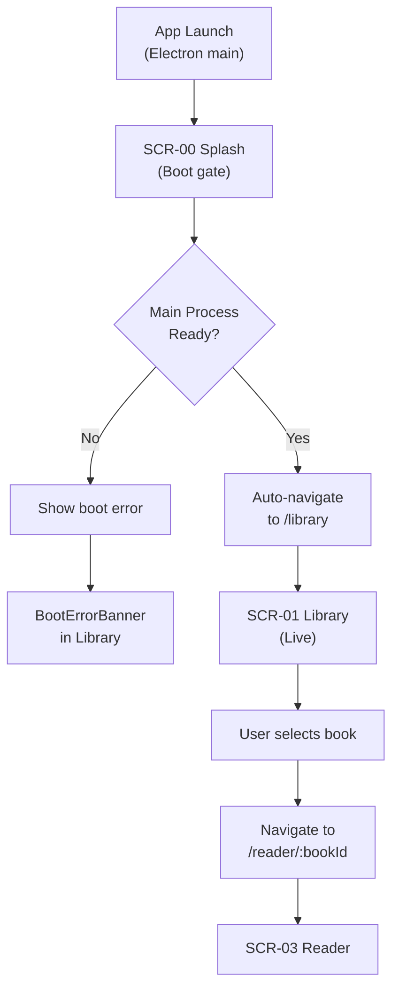

### Luồng Import (từ Library)

> Chi tiết từng trạng thái lỗi: §9 *Import Errors*; state machine: §9 *Import state machine*.

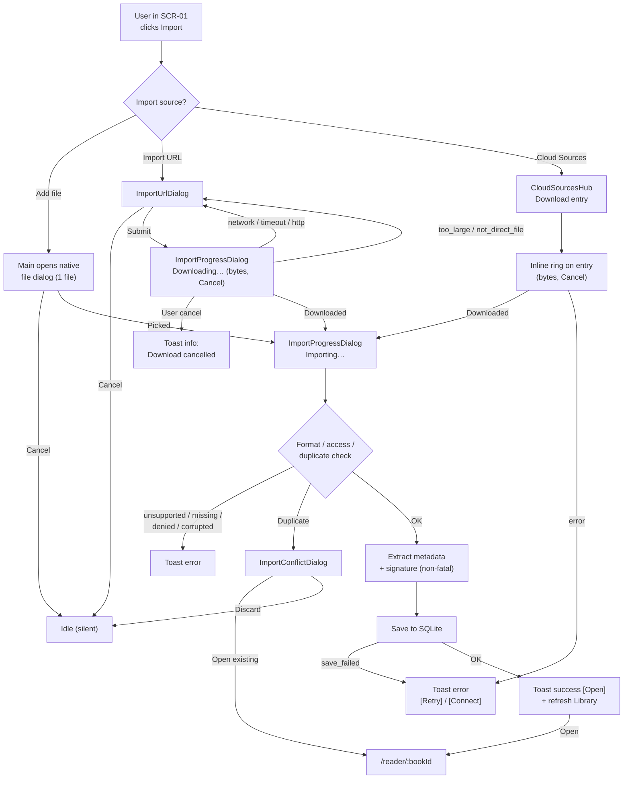

### Luồng Reading Session (dalam Reader)

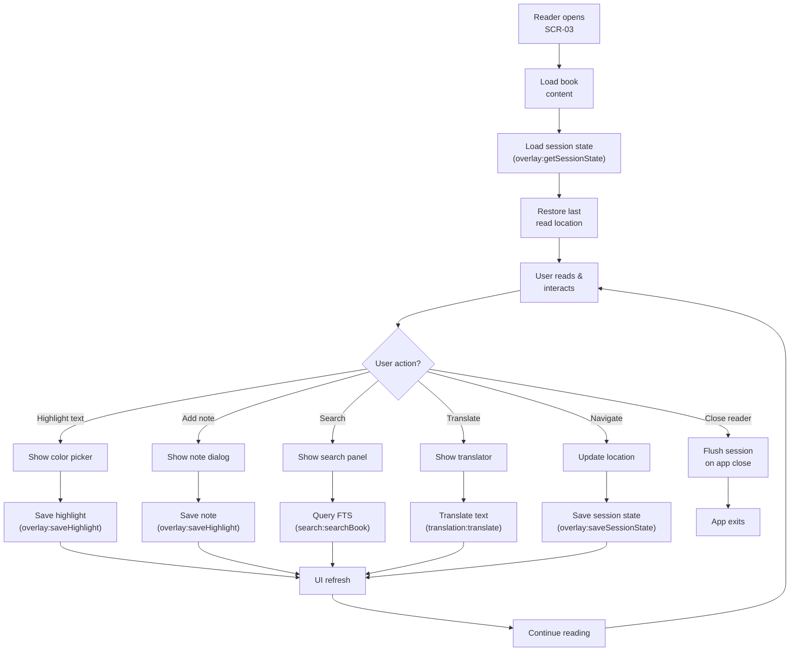

---

## 3. Chi tiết từng Screen

### SCR-00: Splash Screen

**Mục đích:** Boot gate & branding  
**Nơi:** `src/screens/Splash/`  
**Components chính:**
- `SplashBrand` — Logo & brand text
- `SplashSpinner` — Loading indicator

**Luồng:**
1. App khởi động, render Splash
2. `useSplashBoot()` hook kiểm tra Main process ready
3. Nếu ready → auto-navigate đến `/library`
4. Nếu boot error → show `BootErrorBanner` (sau khi navigate)

**State:**
- `bootError?: string` (từ location state)

**IPC calls:**
- `app:ping` (implicit trong boot check)

---

### SCR-01: Library Screen

**Mục đích:** Quản lý thư viện sách  
**Nơi:** `src/screens/Library/`  
**Components chính:**

> Bố cục Library (sidebar + Grid ⇄ Table + Continue Reading) — chi tiết: `docs/change_plan/library_layout_redesign.md`.

#### Layout & Top-level
- `LibraryScreen` (shell: hub ↔ Collections ↔ Cloud Sources + dialogs)
- `LibraryHub` (home: sidebar + browse area)
- `LibrarySidebar` (All books / Reading / Not started / Completed / Favorites + counts)
- `LibraryTopBar` (search + import buttons)
- `ContinueReading` (≤ 3 sách đang đọc, chỉ ở All books, không search)
- `LibraryBrowseToolbar` (tiêu đề filter + số sách, Sort, Grid ⇄ Table — được nhớ)
- `LibraryBookGrid` (lưới tự xuống dòng, cuộn dọc) → `ShelfRailCard`
- `LibraryBookTable` (bảng, chọn dòng) + `LibraryBookDetailPanel` (panel bên phải)
- `LibraryEmptyState` (empty library message)
- `BootErrorBanner` (boot error, nếu có)

#### Collection detail (tab Collections)
- `ShelfDetailView` (Back · tên collection · Grid/List) → `ShelfRailCard` / `ShelfDetailItem`
- `ViewModeToggle` (grid ↔ list, chỉ cho collection detail)

#### Dialogs & Popups
- `LibraryBookInfoDialog` (book info + reading status)
- `EditBookMetadataDialog` (edit metadata)
- `ConfirmBookActionDialog` (confirm actions)
- `BookItemMenu` (context menu for book)
- `NewCollectionDialog` (create/edit collection)
- `CollectionsHub` (sidebar for collections)
- `CloudSourcesHub` (cloud integrations)

#### Import Dialogs
- `ImportProgressDialog` (Downloading / Importing; byte progress khi biết size; nút Cancel khi đang tải URL)
- `ImportConflictDialog` (duplicate — Open existing / Discard; dùng chung cho File, URL, Cloud)
- `ImportUrlDialog` (URL input; giữ URL + hiện lỗi inline sau khi tải thất bại; nút Retry cho lỗi tạm thời)
- `ImportToast` (toast chung của Library; có thể kèm 1 action: Open / Retry / Connect)

**Shelves (định nghĩa sẵn):**
- Continue Reading (sách đang đọc, sorted by last-read-at)
- In Progress (sách được mark as reading)
- All Books (tất cả)
- Favorites (sách favorite)
- Completed (sách completed)
- Genres (shelves per genre, dynamic)

**Features:**
- **Search:** Global search across title/author/description
- **Filter:** By reading status, favorites, genres
- **Collections:** User-curated collections (n-n với books)
- **Metadata editing:** Edit title, author, description, genres
- **Book actions:**
  - Open (→ Reader)
  - Mark as reading / completed
  - Toggle favorite
  - Show in folder (file management)
  - Copy file path
  - Edit metadata
  - Remove from library
  - Delete file (managed books only)
  - Locate file (if moved)
  - Check signature
  - Add to / remove from collection

**State Management (useLibraryScreen):**
```typescript
// Navigation
navigate: (path) => void
openReader: (bookId) => void
goCollections: () => void

// Search & filter
searchQuery: string
setSearchQuery: (q) => void
filterConfig: FilterConfig
filterItems: (list, query, filter) => filtered

// Book info dialog
bookInfoId: string | null
setBookInfoId: (id) => void
bookInfoBook: BookSummaryDto | null

// Edit metadata
editMetadataBook: BookSummaryDto | null
setEditMetadataId: (id) => void
handleSaveMetadata: (id, values) => Promise<void>

// Book menu
bookMenu: { bookId, point } | null
menuBook: BookSummaryDto | null
setBookMenu: (menu) => void
handleOpenBookMenu: (bookId, point) => void

// Removal
pendingRemoval: { bookId, kind } | null
setPendingRemoval: (removal) => void
confirmPendingRemoval: () => Promise<void>

// Book actions
handleToggleFavorite: (bookId) => void
handleMarkCompleted: (bookId) => void
handleOpenFileLocation: (bookId) => void
handleCopyFilePath: (bookId) => void
handleAddToCollection: (bookId, collectionId) => void
handleRemoveFromCollection: (bookId, collectionId) => void

// Import (state in zustand `useLibraryImportStore`, driven by `useLibraryImport`)
toast: { message, variant, action?: { label, run } } | null
clearToast: () => void
progress: { source: 'file' | 'url', stage: 'downloading' | 'importing', filename?, receivedBytes?, totalBytes? } | null
canCancel: boolean            // true while a URL download can still be aborted
conflict: { bookId, message? } | null
urlDialog: { open, initialUrl, error: { message, retryable } | null }
closeUrlDialog: () => void
handleFromDevice: () => Promise<void>
handleFromUrl: () => void
handleCancelImport: () => void
handleUrlSubmit: (url) => Promise<void>
handleConflictDiscard: () => void
handleConflictOpenExisting: () => void

// Shelves
view: 'shelves' | 'shelf-detail' | 'collection'
activeShelf: ShelfId | null
shelfItems: LibraryBook[]
reorderShelf: (shelfId, order) => void
reorderSections: (order) => void
hideEmptyShelves: boolean
visibleShelfIds: ShelfId[]
shelfCounts: Record<ShelfId, number>
viewMode: 'grid' | 'list'
setViewMode: (mode) => void

// Collections
openCollection: (collectionId) => void
collections: CollectionSummaryDto[]
activeCollection: CollectionSummaryDto | null
collectionItems: LibraryBook[]
newCollectionOpen: boolean
openNewCollection: () => void
openEditCollection: (collection) => void
closeCollectionDialog: () => void
submitCollection: (values) => Promise<void>
editingCollection: CollectionSummaryDto | null
pendingCollectionDelete: CollectionSummaryDto | null
confirmCollectionDelete: () => Promise<void>

// Empty states
isEmpty: boolean
noSearchMatches: boolean
showShelves: boolean
```

**IPC Calls:**
- `library:listBooks` → list all books with sessions
- `library:getBook` → get single book details
- `library:markAsReading` → mark as in-progress
- `library:markAsCompleted` → mark as completed
- `library:setFavorite` → toggle favorite
- `library:updateMetadata` → update title/author/genres/description
- `library:showInFolder` → open file in native explorer
- `library:copyFilePath` → copy path to clipboard
- `library:removeBook` → remove from library (keep file)
- `library:deleteBookFile` → delete managed book file
- `library:relinkBook` → re-attach moved file
- `library:checkSignature` → verify digital signature
- `library:listCollections` → list all user collections
- `library:createCollection` → create new collection
- `library:updateCollection` → edit collection metadata
- `library:deleteCollection` → delete collection
- `library:addBookToCollection` → add book to collection
- `library:removeBookFromCollection` → remove book from collection
- `import:fromFile` → Main mở native file dialog (1 file), import theo reference; renderer không gửi path
- `import:fromUrl` → tải HTTPS về temp rồi import bản copy app-owned
- `import:cancel` → huỷ lượt tải URL đang chạy
- `import:progress` (Main → renderer) → `{ stage, filename?, receivedBytes?, totalBytes? }`, chỉ gửi sau khi đã chọn file / submit URL
- `cloud:cancelDownload` → huỷ lượt tải Cloud của một `externalId`

---

### SCR-03: Reader Screen

**Mục đích:** Đọc sách & quản lý annotations  
**Nơi:** `src/screens/Reader/`  
**Components chính:**

#### Shell & Layout
- `ReaderScreen` (session wiring + main layout)
- `ReaderShell` (chrome layout, sidebar, canvas)
- `ReadingCanvas` (main content renderer)

#### Chrome (UI controls)
- `ReaderTopbar` (title, controls)
- `ReaderFooter` (location/progress, controls)
- `ReaderZoomViewport` (zoom + pan for zoom-able formats)
- `ToolsMenu` (tools: highlight, note, etc.)
- `MoreMenu` (more options)
- `ReaderOpenStatus` (file status: open, missing, error)

#### Chrome Controls
- `ChromeRevealButton` (show/hide chrome on click)
- `FullscreenButton` (toggle fullscreen)
- `ImmersiveExitButton` (exit immersive reading)
- `ZoomControl` (zoom in/out)

#### Sidebars & Panels
- `SidebarEdgeRail` (left rail: TOC, notes, bookmarks)
- `TocEdgeButton` (toggle TOC)
- `TocSidebar` (table of contents)
- `NoteFloatingMenu` (floating menu for notes)
- `NoteItemMenu` (context menu for note item)

#### Annotation Tools
- `HighlightColorPicker` (color picker for highlights)
- `HighlightEditPopup` (edit existing highlight)
- `NoteTextboxPopup` (sticky note dialog)
- `HighlightContextMenu` (right-click menu on highlight)

#### Companion Tools (Panels)
- `ReaderSearchPanel` (search within book)
- `WordCountPanel` (word count & statistics)
- `ReadAloudMenu` (text-to-speech controls)
- `TranslationPopover` (inline translation)
- `SnapshotOverlay` (screenshot tool)
- `AaSettingsPanel` (reading appearance: font, size, colors)
- `SignInfoPanel` (digital signature info)

#### Dialogs
- `BookInfoDialog` (book metadata in reader)
- `TrashConfirmDialog` (confirm annotation deletion)

**Renderers (format-specific):**
- `EpubRenderer` (EPUB rendering via epub.js)
- PDF renderer (future)
- Text/Markdown renderer
- etc.

**Features:**

1. **Reading Controls:**
   - Navigate by chapter, page, location
   - Zoom & pan (for zoomable formats)
   - Fullscreen & immersive mode

2. **Annotations:**
   - Highlight text (colors: yellow, orange, pink, green, blue)
   - Underline, strikethrough
   - Textbox (sticky note)
   - Edit & delete annotations
   - Tags for highlights
   - Status (normal, completed)

3. **Companion Tools:**
   - **Search:** FTS within book (page indicators, snippets)
   - **Word count:** Total + per-chapter statistics
   - **Read aloud:** TTS support
   - **Translate:** Offline translation (worker thread)
   - **Snapshot:** Capture & copy screen region

4. **Reading Settings (per-book):**
   - Font family, size, line-height
   - Text color & background color
   - Margins, letter-spacing
   - Theme (light, sepia, dark/night)

5. **File Management:**
   - Book signature verification status
   - File location & size
   - Missing/moved file handling

**State Management (useReaderScreen):**

```typescript
// Book & session
bookId: string
ensureTab: (bookId) => void
updateBookTitle: (bookId, title) => void

// Chrome UI
immersive: boolean
fullscreen: boolean
toggleFullscreen: () => Promise<void>
exitFullscreen: () => Promise<void>
immersiveReveal: () => void
readerChromeMenu: ReaderChromeMenuApi

// Search
readerSearchQuery: string
setReaderSearchQuery: (q) => void
readerSearchRequestId: string
requestReaderSearch: (q) => void

// Global reading prefs (per-app, not per-book)
globalPrefs: GlobalReadingPrefs
setGlobalPrefs: (prefs) => void

// Zoom (for zoomable formats)
zoomLevel: number
setZoomLevel: (level) => void

// Highlights & notes
highlights: HighlightDto[]
bookmarks: BookmarkDto[]
deleteHighlight: (highlightId) => Promise<void>
saveHighlight: (highlight) => Promise<void>

// Reading session state (per-book)
sessionState: ReadingSessionState
saveSessionState: (state) => Promise<void>
```

**IPC Calls:**
- `overlay:getSessionState` → get reading session (location, prefs)
- `overlay:saveSessionState` → save location & per-book prefs
- `overlay:listHighlights` → get all annotations
- `overlay:saveHighlight` → save/update annotation
- `overlay:deleteHighlight` → delete annotation
- `overlay:listBookmarks` → get all bookmarks
- `overlay:saveBookmark` → save/update bookmark
- `overlay:deleteBookmark` → delete bookmark
- `library:openBookContent` → open book file stream
- `library:getBook` → get book metadata
- `library:markAsReading` → mark as reading
- `search:searchBook` → FTS search (counts, positions, snippets)
- `bookIndex:ensure` → ensure book is indexed for search
- `bookIndex:status` → subscribe to indexing progress
- `translation:translate` → translate text (worker)
- `translation:progress` → subscribe to model download progress
- `wordCount:getStats` → get word count statistics
- `app:captureSnapshot` → capture screen region
- `library:checkSignature` → verify book signature

---

### SCR-05: Reading Settings

**Mục đích:** Cài đặt đọc sách (per-book preferences)  
**Nơi:** `src/screens/Reader/components/settings/`  
**Component:** `AaSettingsPanel` (nội tuyến trong Reader sidebar)

**Settings:**
- **Font:** Font family selection (e.g., "Georgia", "Roboto", "Serif", "Sans-serif")
- **Size:** Font size (px, range: 12–48)
- **Line-height:** Line spacing (ratio, range: 1.0–2.0)
- **Letter-spacing:** Character spacing
- **Text color:** Text color picker
- **Background color:** Background color picker
- **Margins:** Left/right margins (px)
- **Theme preset:** Light, Sepia, Night (dark)

**Storage:**
- Saved per-book in `reading_session_state_json` under `books.reading_state_json`
- Read/write via `overlay:saveSessionState`

**IPC Calls:**
- `overlay:saveSessionState` (with prefs)

---

### SCR-06: App Settings

**Mục đích:** Cài đặt ứng dụng toàn cục  
**Nơi:** `src/screens/Settings/`  
**Component:** `SettingsScreen`

**Sections:**

1. **Appearance:**
   - Theme (Light, Dark, Auto)
   - Font rendering options

2. **Reading Defaults:**
   - Global font family, size, line-height
   - Default theme for new sessions

3. **File Management:**
   - Scan for books in folder (future)
   - File import location settings

4. **Linked Libraries (Cloud):**
   - Google Drive connection status
   - Dropbox connection status
   - OneDrive connection status
   - Connect / disconnect buttons

5. **Languages & Translation:**
   - UI language
   - Translation model settings

6. **Keyboard & Accessibility:**
   - Keyboard shortcuts
   - Accessibility options

**Storage:**
- Electron store (platform-specific)
- Desktop: `~/.config/reading-book-app/` (or Windows equivalent)

**IPC Calls:**
- `cloud:connect` (Google Drive, Dropbox, OneDrive)
- `cloud:disconnect`
- `cloud:getAccessToken`

---

## 4. Sequence Diagrams — Các use cases chính

### UC-01: Import Book từ File

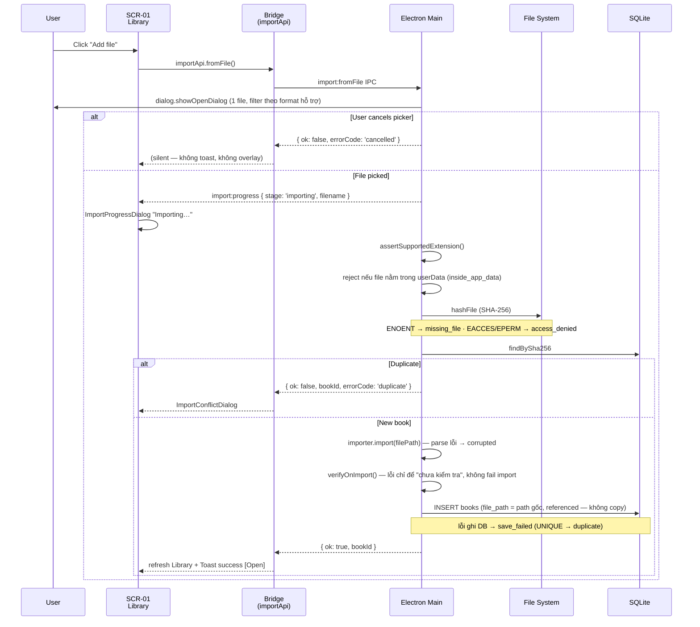

### UC-02: Import Book từ URL

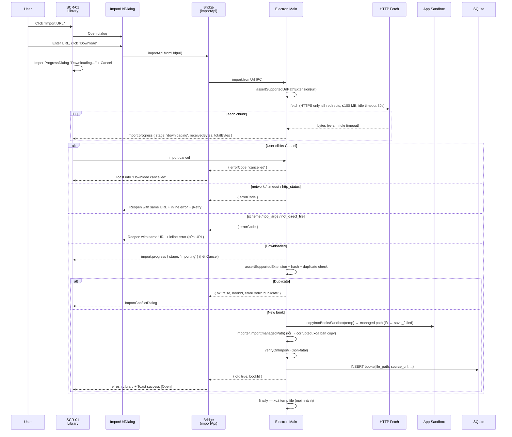

### UC-03: Mở và Đọc Sách

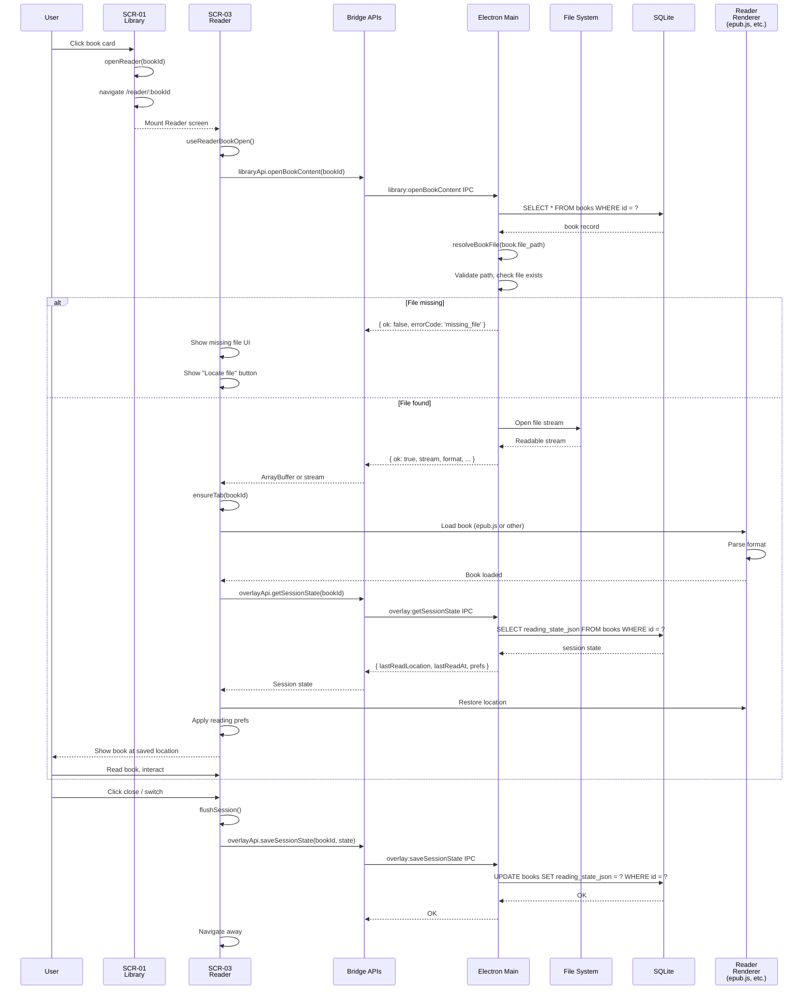

### UC-04: Tạo Highlight & Note

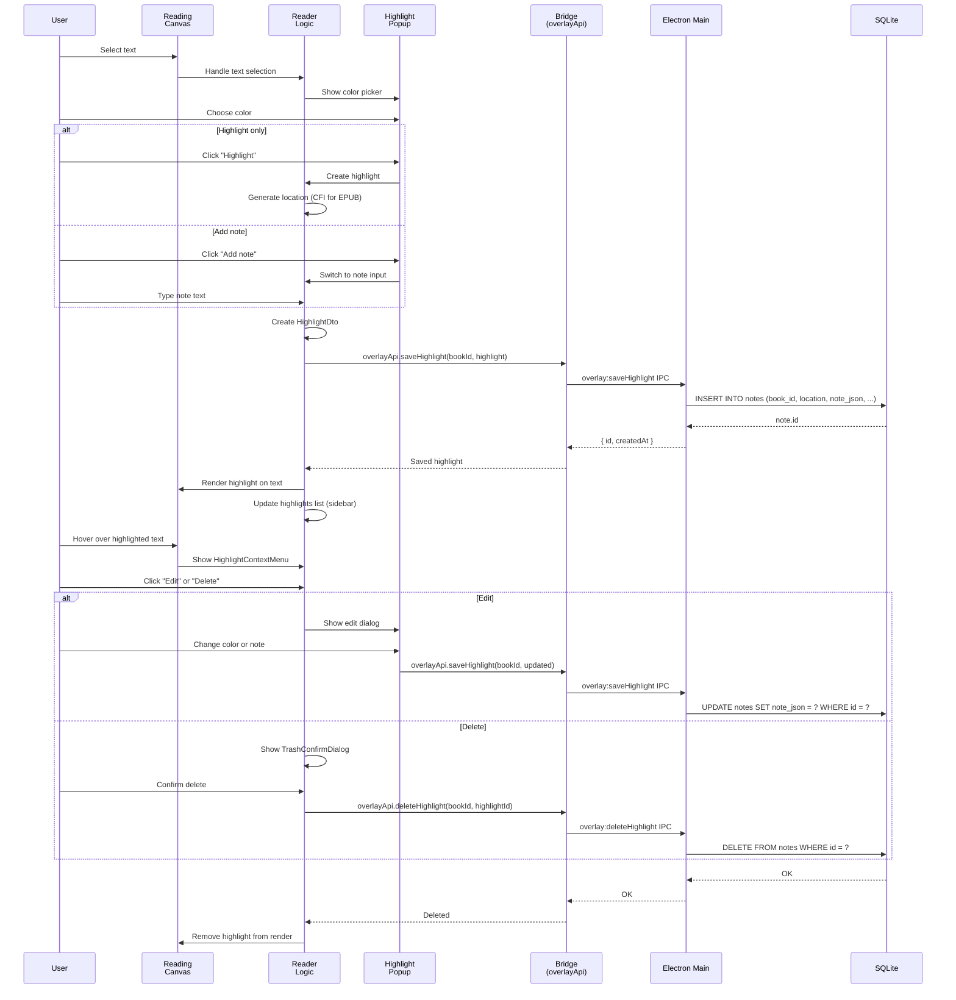

### UC-05: Quản lý Library (Metadata & Collections)

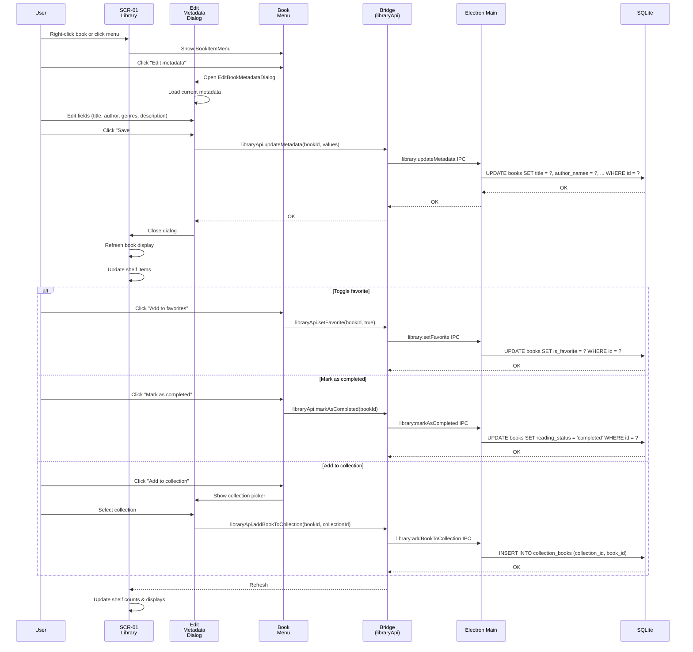

### UC-06: Kết nối Cloud Sources

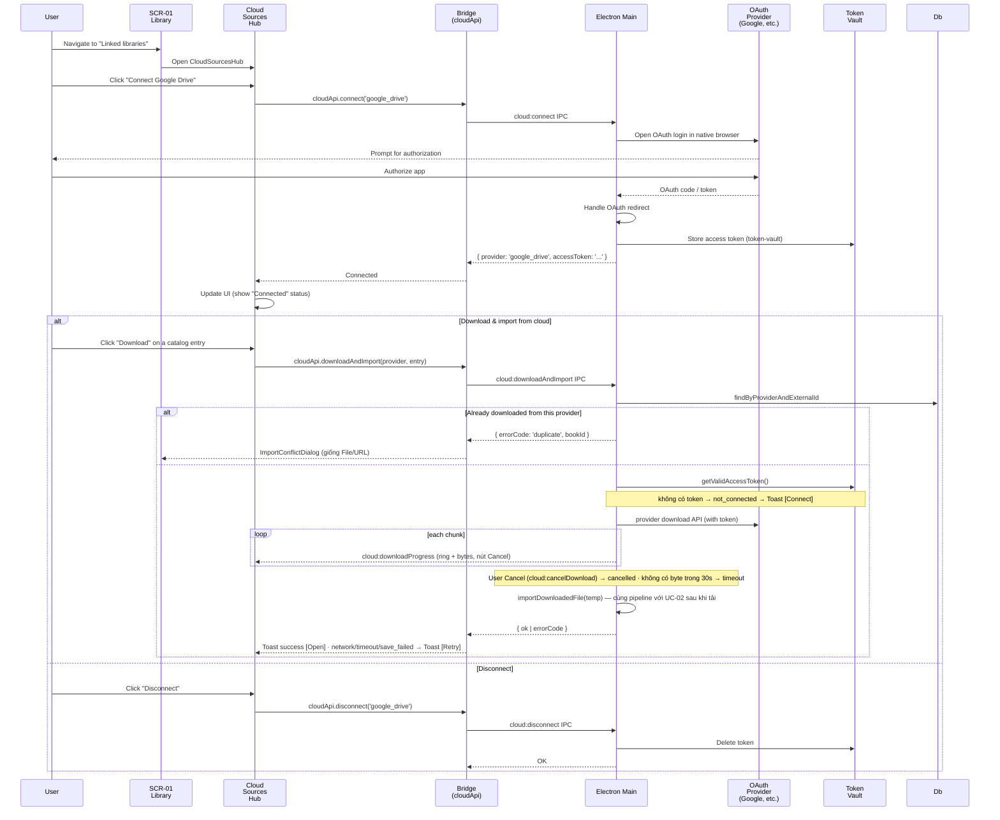

### UC-07: Tìm kiếm trong Sách

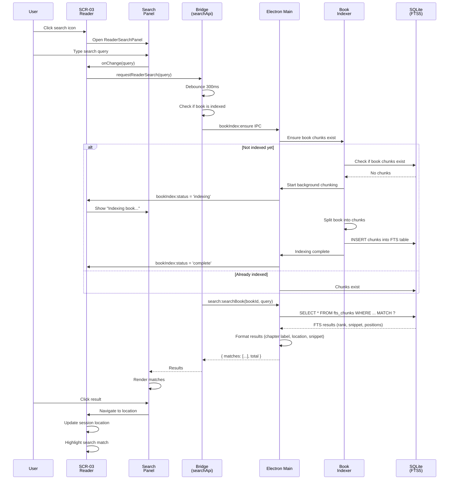

### UC-08: Dịch Văn bản

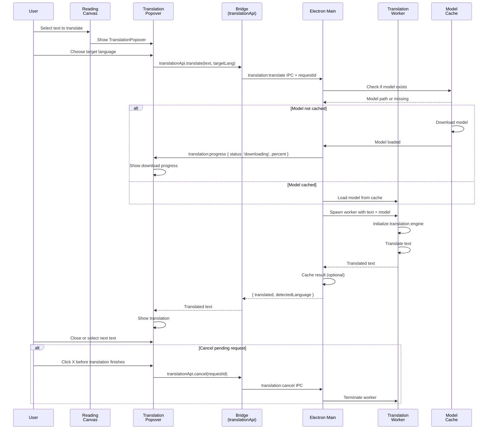

---

## 5. Component Hierarchy

### LibraryScreen
```
LibraryScreen
├── [view === 'hub'] LibraryHub
│   ├── LibrarySidebar (status filters + Favorites)
│   └── Browse column
│       ├── LibraryTopBar (search + Add file / Import URL)
│       ├── BootErrorBanner (if bootError)
│       ├── LibraryEmptyState (if no books)
│       ├── ContinueReading (All books, no search)
│       ├── LibraryBrowseToolbar (title · count · Sort · Grid/Table)
│       ├── LibraryBookGrid → ShelfRailCard x N      (layout = grid)
│       └── LibraryBookTable + LibraryBookDetailPanel (layout = table)
├── [view === 'collections'] CollectionsHub
├── [view === 'collection'] ShelfDetailView → ShelfRailCard / ShelfDetailItem
├── [view === 'cloud-sources'] CloudSourcesHub
│
├── Dialogs
│   ├── LibraryBookInfoDialog
│   ├── EditBookMetadataDialog
│   ├── ConfirmBookActionDialog
│   ├── BookItemMenu (context menu)
│   ├── NewCollectionDialog
│   ├── CollectionsHub (sidebar)
│   ├── CloudSourcesHub (sidebar)
│   ├── ImportProgressDialog
│   ├── ImportConflictDialog
│   ├── ImportUrlDialog
│   └── ImportToast

└── (Behind scenes)
    └── useLibraryScreen (main logic)
        ├── useLibraryBooks (fetch & manage books)
        ├── useLibraryImport (import logic)
        ├── useCollections (collections logic)
        ├── useLibraryView (view state)
        ├── useCloudSources (cloud integrations)
        ├── useShelfOrder (reorder shelves)
        └── useSectionOrder (reorder sections)
```

### ReaderScreen
```
ReaderScreen
└── ReaderShell (layout container)
    ├── ReaderTopbar
    │   ├── Title
    │   ├── Tools menu
    │   └── More menu
    │
    ├── Content area
    │   ├── SidebarEdgeRail (left, collapsible)
    │   │   └── [activeTab]
    │   │       ├── TocSidebar (chapters)
    │   │       ├── NotesPanel (highlights/notes/bookmarks)
    │   │       └── BookmarksPanel
    │   │
    │   └── ReaderZoomViewport
    │       └── ReadingCanvas
    │           └── EpubRenderer (or PDF/Text renderer)
    │               └── [Document content]
    │
    ├── ReaderFooter
    │   ├── Location indicator
    │   ├── Reading time estimate
    │   └── Jump to location button
    │
    ├── Floating Panels (when active)
    │   ├── ReaderSearchPanel
    │   ├── WordCountPanel
    │   ├── ReadAloudMenu
    │   ├── TranslationPopover
    │   ├── SnapshotOverlay
    │   ├── AaSettingsPanel
    │   └── SignInfoPanel
    │
    ├── Dialogs
    │   ├── BookInfoDialog
    │   ├── TrashConfirmDialog
    │   ├── HighlightColorPicker
    │   ├── HighlightEditPopup
    │   ├── NoteTextboxPopup
    │   └── HighlightContextMenu
    │
    └── (Behind scenes)
        └── useReaderScreen (session wiring)
            ├── useReaderBookOpen (load book)
            ├── useReaderSessionBridge (sync session state)
            ├── useReaderHighlights (manage highlights)
            ├── useReaderSearch (FTS search)
            ├── useWordCount (word stats)
            ├── useReadAloud (TTS)
            ├── useReaderTranslation (translation)
            ├── useSnapshotTool (screenshot)
            ├── useBookIndexing (ensure indexed)
            ├── useReaderZoomControls (zoom)
            ├── useReaderChromeUi (chrome state)
            ├── useReaderNavigation (location updates)
            ├── useImmersiveReading (immersive mode)
            └── useGlobalReadingPrefs (reading preferences)
```

---

## 6. State Management

### Global State (Zustand stores)

```typescript
// App chrome state
useAppNav() → {
  currentNav: AppStubNavId
  registerLibraryNav: () => void
  // ...
}

useOpenReading() → {
  openBookId: string | null
  openBook: (bookId) => void
  ensureTab: (bookId) => void
  updateBookTitle: (bookId, title) => void
}

useAppTitle() → {
  documentTitle: string
  documentSubtitle: string
  setDocumentTitle: (title) => void
  setDocumentSubtitle: (subtitle) => void
  // ... search-related
}

// Reading preferences (per-app global)
useGlobalReadingPrefs() → {
  prefs: GlobalReadingPrefs
  setPrefs: (prefs) => void
}

// Immersive reading state
useImmersiveReading() → {
  immersive: boolean
  fullscreen: boolean
  toggleFullscreen: () => void
  exitFullscreen: () => void
}
```

### Local Screen State (useState)

```typescript
// Library
- searchQuery, setSearchQuery
- bookInfoId, setBookInfoId
- editMetadataId, setEditMetadataId
- bookMenu, setBookMenu
- pendingRemoval, setPendingRemoval
- toast, clearToast
- progress, conflict, urlDialog (import state — zustand `useLibraryImportStore`)
- view, activeShelf, activeCollection
- viewMode, setViewMode
- collections, newCollectionOpen, editingCollection
- filterConfig, hideEmptyShelves

// Reader
- readerSearchQuery, setReaderSearchQuery
- highlights, bookmarks (from useReaderHighlights)
- sessionState (from useReaderSessionBridge)
- zoomLevel (from useReaderZoomControls)
- highlightTool, annotationTool (active tool)
- sidebarOpen, activeSidebarTab
```

### Async Hooks (data fetching)

```typescript
// Library
useLibraryBooks() → {
  books: LibraryBook[]
  isLoading: boolean
  error: Error | null
  refetch: () => void
}

useCollections() → {
  collections: CollectionSummaryDto[]
  isLoading: boolean
  error: Error | null
}

// Reader
useReaderBookOpen(bookId) → {
  book: Book | null
  content: ArrayBuffer | null
  isLoading: boolean
  error: Error | null
}

useReaderSessionBridge(bookId) → {
  sessionState: ReadingSessionState | null
  saveSessionState: (state) => Promise<void>
}

useReaderHighlights(bookId) → {
  highlights: HighlightDto[]
  bookmarks: BookmarkDto[]
  saveHighlight: (h) => Promise<void>
  deleteHighlight: (id) => Promise<void>
}

useReaderSearch(bookId) → {
  searchQuery: string
  setSearchQuery: (q) => void
  results: SearchResult[]
  isLoading: boolean
  requestSearch: (q) => void
}
```

### IPC Bridges (typed API wrappers)

```typescript
// src/bridge/library.ts
libraryApi = {
  listBooks: () => Promise<BookSummaryDto[]>
  getBook: (id) => Promise<BookSummaryDto | null>
  openBookContent: (id) => Promise<OpenBookContentResult>
  markAsReading: (id) => Promise<void>
  markAsCompleted: (id) => Promise<void>
  setFavorite: (id, isFavorite) => Promise<void>
  updateMetadata: (id, values) => Promise<void>
  showInFolder: (id) => Promise<void>
  copyFilePath: (id) => Promise<void>
  removeBook: (id) => Promise<void>
  deleteBookFile: (id) => Promise<void>
  relinkBook: (id) => Promise<RelinkBookResult>
  checkSignature: (id) => Promise<CheckSignatureResult>
  listCollections: () => Promise<CollectionSummaryDto[]>
  createCollection: (values) => Promise<CollectionSummaryDto>
  updateCollection: (id, values) => Promise<void>
  deleteCollection: (id) => Promise<void>
  addBookToCollection: (bookId, collectionId) => Promise<void>
  removeBookFromCollection: (bookId, collectionId) => Promise<void>
}

// src/bridge/import.ts
importApi = {
  fromFile: () => Promise<ImportResult>          // Main owns the native dialog
  fromUrl: (url) => Promise<ImportResult>
  cancel: () => Promise<OkResult>                 // abort in-flight URL download
  onProgress: (handler) => () => void             // import:progress subscription
}

// src/bridge/overlay.ts
overlayApi = {
  getSessionState: (bookId) => Promise<ReadingSessionState>
  saveSessionState: (bookId, state) => Promise<void>
  listBookmarks: (bookId) => Promise<BookmarkDto[]>
  saveBookmark: (bookId, bookmark) => Promise<void>
  deleteBookmark: (bookId, bookmarkId) => Promise<void>
  listHighlights: (bookId) => Promise<HighlightDto[]>
  saveHighlight: (bookId, highlight) => Promise<void>
  deleteHighlight: (bookId, highlightId) => Promise<void>
}

// src/bridge/search.ts
searchApi = {
  searchBook: (bookId, query) => Promise<SearchResult>
}

// src/bridge/translation.ts
translationApi = {
  translate: (text, targetLang) => Promise<{ translated: string }>
  cancel: (requestId) => void
}

// src/bridge/app.ts
appApi = {
  ping: () => Promise<void>
  getAppInfo: () => Promise<AppInfo>
  getGoogleOAuthConfig: () => Promise<OAuthConfig>
  setChromeTheme: (theme) => Promise<void>
  getFullscreen: () => Promise<boolean>
  setFullscreen: (fullscreen) => Promise<void>
  toggleFullscreen: () => Promise<boolean>
  captureSnapshot: (region) => Promise<void>
  on: (channel, listener) => UnsubscribeFn
}

// src/bridge/cloud.ts
cloudApi = {
  connect: (provider) => Promise<{ provider, accessToken }>
  disconnect: (provider) => Promise<void>
  getAccessToken: (provider) => Promise<string>
  downloadAndImport: (provider, entry) => Promise<CloudDownloadResult>
  cancelDownload: (externalId) => Promise<OkResult>
  onDownloadProgress: (handler) => () => void
}
```

---

## 7. Data Flow Diagrams

### Data Flow: Book Import (File)

```
User clicks "Add file"
    ↓
importApi.fromFile()                      (no path from renderer)
    ↓ (IPC)
Main: native file dialog ── cancel ──→ { errorCode: 'cancelled' } → silent
    ↓ picked
import:progress { stage: 'importing' } → ImportProgressDialog
    ↓
[1] Validate extension            → unsupported_format
[2] Reject path inside userData   → inside_app_data
[3] Hash file (SHA-256)           → missing_file / access_denied
[4] Check duplicate in DB         → duplicate → ImportConflictDialog
[5] Parse metadata                → corrupted
[6] Verify signature              (non-fatal: stored as "not checked")
[7] INSERT book                   → save_failed
    ↓
{ ok: true, bookId } → refresh Library → Toast success [Open]
```

### Data Flow: Reading Session (Save)

```
User closes reader / app closes
    ↓
ReaderScreen: flushSession()
    ↓
useReaderSessionBridge.saveSessionState(state)
    ↓
overlayApi.saveSessionState(bookId, state)
    ↓ (IPC)
Main process: overlay:saveSessionState handler
    ↓
[1] Validate bookId
[2] Merge session state into books.reading_state_json
[3] UPDATE books SET reading_state_json = ? WHERE id = ?
    ↓
SQLite: JSON update committed
    ↓
overlayApi response (OK)
    ↓
Session saved ✓
```

### Data Flow: Highlight Search & Render

```
User selects text
    ↓
Canvas: handleTextSelection()
    ↓
Show HighlightColorPicker
    ↓
User chooses color & clicks "Highlight"
    ↓
overlayApi.saveHighlight(bookId, highlight)
    ↓ (IPC)
Main process: overlay:saveHighlight handler
    ↓
[1] Validate highlight data
[2] Generate highlight ID (UUID)
[3] INSERT INTO notes (book_id, note_json, location, ...)
    ↓
SQLite: Note inserted
    ↓
overlayApi response { id, createdAt }
    ↓
useReaderHighlights: Add to highlights list
    ↓
Canvas: Render highlight via renderer API
    ↓
User sees highlighted text ✓
```

---

## 8. Navigation & Routing

### App Router Structure

```typescript
// src/App.tsx (root router)
<BrowserRouter>
  <Routes>
    <Route path="/" element={<SplashScreen />} />
    
    <Route path="/library" element={<LibraryLayout />}>
      <Route index element={<LibraryScreen />} />
      <Route path="shelf/:shelfId" element={<LibraryScreen />} />
      <Route path="collection/:collectionId" element={<LibraryScreen />} />
    </Route>
    
    <Route path="/reader/:bookId" element={<ReaderLayout />}>
      <Route index element={<ReaderScreen />} />
    </Route>
    
    <Route path="/settings" element={<SettingsScreen />} />
  </Routes>
</BrowserRouter>
```

### Navigation Helpers

```typescript
// useAppNav() — main nav state
const { currentNav, registerLibraryNav } = useAppNav()

// useOpenReading() — book reader nav
const { openBook } = useOpenReading()
openBook(bookId) // navigate to /reader/:bookId

// useNavigate() — React Router
const navigate = useNavigate()
navigate('/library', { state: { openNav: 'collections' } })
navigate('/reader/book-id-123')
```

---

## 9. Error Handling & Edge Cases

### Import Errors

Mã lỗi là `ImportErrorCode` (`electron/ipc/api-types.ts`, đồng bộ với book-reader-sdk). Nguyên tắc:
**Dialog** chỉ khi cần user quyết định · **Inline** khi user phải sửa input của chính họ (URL) ·
**Toast** cho kết quả cuối · **Retry** chỉ cho lỗi tạm thời.

| Trạng thái / `errorCode` | Nguồn | UI | Retry | Hành động user | Sau đó |
|---|---|---|---|---|---|
| Success (`ok: true`) | File · URL · Cloud | Toast success + **[Open]** | — | Open / bỏ qua | Reader `/reader/:bookId` hoặc ở lại Library (đã refresh) |
| `duplicate` | File · URL · Cloud (SHA-256 hoặc cùng provider+externalId) | `ImportConflictDialog` | — | Open existing / Discard | Reader hoặc Idle |
| `unsupported_format` | File · URL · Cloud | Toast error | — | — | Idle |
| `corrupted` (parse/metadata lỗi) | File · URL · Cloud | Toast error | — | — | Idle; bản copy app-owned (URL/Cloud) đã xoá |
| `access_denied` (EACCES/EPERM) | File | Toast error | — | Chọn file khác | Idle |
| `missing_file` (ENOENT) | File | Toast error | — | — | Idle |
| `inside_app_data` | File | Toast error | — | Chọn file ngoài thư mục data của app | Idle |
| `network` | URL | Inline trong `ImportUrlDialog` (giữ URL) | **Retry** | Retry / sửa URL / Cancel | Downloading |
| `network` | Cloud | Toast error + **[Retry]** | **Retry** | Retry | Downloading |
| `timeout` (không nhận byte trong 30s) | URL · Cloud | như `network` | **Retry** | Retry | Downloading |
| `http_status` | URL | Inline + Retry | **Retry** | Retry / sửa URL | Downloading |
| `scheme` · `too_large` · `not_direct_file` | URL | Inline (giữ URL) | — | Sửa URL / Cancel | UrlInput |
| `save_failed` (copy sandbox / ghi DB) | URL · Cloud | Toast error + **[Retry]** | **Retry** | Retry | Downloading |
| `save_failed` | File | Toast error | — | Thử lại thủ công | Idle |
| `not_connected` | Cloud | Toast error + **[Connect]** | — | Connect | OAuth flow |
| `cancelled` — đóng picker / dialog URL | File · URL | Không hiện gì | — | — | Idle |
| `cancelled` — huỷ khi đang tải | URL · Cloud | Toast info "Download cancelled." | — | — | Idle (temp đã xoá) |
| Signature check lỗi | File · URL · Cloud | **Không chặn import**, không báo lúc import | — | — | Success; Reader hiện "chưa kiểm tra" và kiểm tra lại khi mở |

Ghi chú:
- Progress overlay chỉ hiện **sau khi** đã chọn file (Main gửi `import:progress`) — không bao giờ che native picker.
- Chỉ có Cancel trong giai đoạn **downloading**; giai đoạn importing ngắn và không huỷ được.
- Cloud SDK không hỗ trợ abort: khi huỷ/timeout, Main trả kết quả ngay và dọn temp khi lượt tải nền kết thúc.

### Import state machine

```
Idle
 ├─ Add file ──▶ Picking ──cancel──▶ Idle (silent)
 │                  └─ picked ─▶ Importing
 ├─ Import URL ─▶ UrlInput ──cancel──▶ Idle
 │                  └─ submit ─▶ Downloading ──Cancel──▶ Idle + toast info
 │                                 ├─ network | timeout | http_status ─▶ UrlInput[error, Retry]
 │                                 ├─ scheme | too_large | not_direct_file ─▶ UrlInput[error]
 │                                 └─ downloaded ─▶ Importing
 └─ Cloud Download ─▶ (not_connected ─▶ Idle + toast[Connect])
                      └─ Downloading ──Cancel──▶ Idle + toast info
                            ├─ network | timeout ─▶ Idle + toast[Retry]
                            └─ downloaded ─▶ Importing

Importing  (format → access → dedup → metadata → signature (non-fatal) → persist)
 ├─ ok                                  ─▶ Success   ─▶ toast[Open] ─▶ Idle | Reader
 ├─ duplicate                           ─▶ Duplicate ─▶ ConflictDialog ─▶ Open: Reader | Discard: Idle
 ├─ unsupported_format | corrupted      ─▶ Failed    ─▶ toast ─▶ Idle
 ├─ access_denied | missing_file | inside_app_data ─▶ Failed ─▶ toast ─▶ Idle
 └─ save_failed                         ─▶ Failed    ─▶ toast[Retry] (URL/Cloud) ─▶ Downloading | Idle
```

### Reader Errors

| Error | User Flow |
|-------|-----------|
| `missing-file` | ReaderOpenStatus: "File not found. [Locate file] button" |
| `path-denied` | ReaderOpenStatus: "No permission to read file" |
| `format-error` | Toast: "Failed to open book" |
| `signature-invalid` | SignInfoPanel: "Book signature is invalid" |

### Session Management

```typescript
// Flush session on app close
app.on('before-quit', () => {
  ipcMain.emit('app:requestFlushSession')
  // Wait for renderer to flush or timeout
  // Then save session state to DB
  // Then exit
})

// Handle window close
mainWindow.on('close', (e) => {
  e.preventDefault()
  ipcMain.emit('app:requestFlushSession')
  // After flush, app.quit()
})
```

---

## 10. Accessibility & Keyboard Shortcuts

### Keyboard Shortcuts

| Action | Shortcut |
|--------|----------|
| Search in book | Ctrl+F |
| Translate | Ctrl+T |
| Fullscreen | F11 |
| Immersive mode | Esc |
| Highlight | Ctrl+H |
| Search library | Ctrl+L |
| Open settings | Ctrl+, |
| Next page | Page Down / Right |
| Prev page | Page Up / Left |

### ARIA & Semantic HTML

- All dialogs have `role="dialog"` and `aria-labelledby`
- Buttons have descriptive labels
- Forms have associated `<label>`
- Icons have `aria-label`
- Modals trap focus

---

## 11. Performance Considerations

### Virtualization
- **Library shelves:** Virtualize shelf items (hundreds of books)
- **Notes panel:** Virtualize notes list (can be large)

### Code Splitting
- Reader screen code-split from Library
- Settings screen code-split
- Format renderers loaded on-demand

### Optimization
- Memoize shelf components (expensive sorting)
- Lazy-load book covers (intersection observer)
- Debounce search queries (300ms)
- Batch SQLite queries (e.g., listBooks)

---

**End of document**
