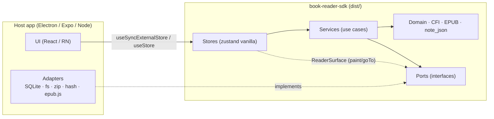

# book-reader-sdk

Lõi nghiệp vụ **độc lập nền tảng** của reading-book-app: kiểu dữ liệu domain, xử lý CFI, phân tích
gói EPUB, logic annotation (highlight / underline / strikethrough / text note / bookmark), và các
**zustand store** quản lý trạng thái đọc sách. Mọi thao tác I/O (SQLite, file system, giải nén ZIP,
hash, engine render) đều do **host app inject** lúc khởi tạo.

- `dist/` **tự chứa**: không có `import`/`require` tới package nào (zustand/vanilla được bundle
  sẵn). Copy thư mục SDK tới bất kỳ đâu, trỏ relative path là chạy — không cần `npm install`,
  không cần monorepo. Script build **tự kiểm tra** điều này và fail nếu vi phạm.
- Core biên dịch với `lib: ES2022`, `types: []` → dùng `fs`, `window`, `Buffer`, `process`,
  `better-sqlite3`, React… trong `src/` là **lỗi compile**, không chỉ là quy ước.
- Tương thích dữ liệu hiện có của desktop: `notes.note_json` (migration 018/019),
  `Location.toString()`, `locatorRef`, `last_read_location`.

## Cấu trúc

```
book-reader-sdk/
├── package.json            exports: import → dist/index.mjs, require → dist/index.cjs (+ .d.mts/.d.cts)
├── tsconfig.json           strict, lib ES2022, types [] (typecheck core)
├── tsconfig.build.json     emit declarations → dist/types
├── scripts/build.mjs       rolldown ESM + CJS, tsc d.ts, kiểm tra self-contained
├── dist/                   ← thứ duy nhất host cần
├── src/
│   ├── index.ts            public API
│   ├── core/               createBookReaderSdk (composition root), errors, event bus, defaults, runtime
│   ├── ports/              INTERFACE host implement: storage, file-system, archive, platform, reader-surface
│   ├── domain/             Book, Location, MarkupAnnotation/Bookmark, ReadingSession, reading prefs
│   ├── cfi/                chuỗi CFI, parse step/offset, so sánh thứ tự tài liệu, codec
│   ├── annotations/        locator pack/unpack, màu, citation, undo history, filter/sort/group
│   ├── epub/               container.xml + OPF (metadata, manifest, spine, cover) — không cần DOMParser
│   ├── persistence/        codec note_json + repository SQL cho bảng `notes` qua port SqlDatabase
│   ├── services/           use case: library (import/dedupe/rollback), annotations, bookmarks, session
│   ├── stores/             zustand vanilla: library, annotations, bookmarks, session
│   └── testing/            adapter in-memory (spec thực thi được của các port)
└── examples/
    ├── node-host/          host Node chạy end-to-end (node:sqlite, node:fs, zip tự viết)
    ├── electron-host/      main: better-sqlite3 + schema desktop hiện có; renderer: IPC storage, epub.js surface, React hooks
    └── expo-host/          template expo-sqlite / expo-file-system / expo-crypto + metro.config.js
```

## Kiến trúc



Luồng phụ thuộc chỉ đi **vào trong**: stores → services → domain/ports. SDK không biết adapter nào
đang chạy; host không cần biết SQL của bảng `notes` hay luật undo/rollback.

### Các port (Dependency Injection)

| Port | Bắt buộc | Mặc định | Ví dụ implementation |
|---|---|---|---|
| `storage.library` / `annotations` / `bookmarks` / `sessions` | ✔ | — | better-sqlite3, expo-sqlite, IPC, in-memory |
| `fileSystem` | khi `importFile` | — | `node:fs`, `expo-file-system` |
| `archive` | không (thiếu → metadata theo tên file) | — | JSZip, fflate |
| `hash` | khi `importFile` | WebCrypto `crypto.subtle` | `node:crypto`, `expo-crypto` |
| `ids` | nếu nền tảng không có `crypto` | `crypto.randomUUID` | `expo-crypto` |
| `clock`, `scheduler`, `logger` | không | `Date`, `setTimeout`, `console` | fake timers trong test |
| `ReaderSurface` (gắn lúc runtime) | không | — | epub.js handle, WebView bridge |

Adapter được **kiểm tra shape lúc runtime** (`ADAPTER_INVALID: storage.annotations is missing
method(s): saveMarkup`) — cần thiết vì SDK cũng được gọi từ JS thuần qua relative path.
Port optional chỉ bị đòi khi thao tác cần nó chạy (`ADAPTER_MISSING`).

Với SQLite, SDK **sở hữu câu SQL** của bảng `notes`, host chỉ đưa driver qua port tối giản:

```ts
interface SqlDatabase {
  run(sql: string, params?: readonly SqlValue[]): Promise<{ changes: number }>
  all<Row>(sql: string, params?: readonly SqlValue[]): Promise<Row[]>
}
```

## Build

```bash
cd source/apps/book-reader-sdk
npm run verify        # typecheck → build → typecheck ví dụ Electron → chạy node-host end-to-end
```

Trong repo này devDependencies (rolldown, typescript, zustand) được resolve từ `source/node_modules`
có sẵn. Ở máy/thư mục khác: `npm install` một lần trong thư mục SDK để **build**; host dùng `dist/`
thì không cần cài gì.

## Dùng SDK từ host ở bất kỳ vị trí nào

Cả 4 cách chỉ dựa trên **đường dẫn tương đối** tới thư mục SDK.

**1. Import tĩnh file ESM** (Node ESM, Vite, Electron main/renderer)

```ts
import { createBookReaderSdk, createInMemoryStorage } from '../book-reader-sdk/dist/index.mjs'
```

TypeScript tự lấy kiểu từ `dist/index.d.mts` bên cạnh.

**2. Import động, đường dẫn quyết định lúc runtime** (plugin, app đặt SDK ở vị trí cấu hình được)

```js
const sdkUrl = new URL(process.env.BOOK_READER_SDK ?? '../../dist/index.mjs', import.meta.url)
const { createBookReaderSdk } = await import(sdkUrl.href)
```

`new URL(..., import.meta.url)` resolve theo **vị trí file host**, không theo `cwd` — app chạy từ
thư mục nào cũng đúng.

**3. CommonJS** (script Node cũ, Electron main build CJS)

```js
const { createBookReaderSdk } = require('../libs/book-reader-sdk')      // package.json main → dist/index.cjs
```

**4. Alias tên package** (khuyến nghị cho app lớn — đổi vị trí SDK chỉ sửa 1 chỗ)

```jsonc
// tsconfig.json
{ "compilerOptions": { "paths": { "@reading-book/book-reader-sdk": ["../book-reader-sdk/dist/index.d.mts"] } } }
```

```ts
// vite.config.ts
resolve: { alias: { '@reading-book/book-reader-sdk': path.resolve(__dirname, '../book-reader-sdk/dist/index.mjs') } }
```

Expo/Metro: xem `examples/expo-host/metro.config.js` (`watchFolders` + `extraNodeModules`, vì Metro
mặc định không đọc file ngoài project root).

## Khởi tạo

```ts
import {
  createBookReaderSdk, createSqlNoteRepositories, cfiLocation, createStoreHook,
} from '@reading-book/book-reader-sdk'

const notes = createSqlNoteRepositories(betterSqliteDatabase(db))   // driver do host cung cấp

const sdk = createBookReaderSdk({
  adapters: {
    storage: { library, sessions, annotations: notes.annotations, bookmarks: notes.bookmarks },
    fileSystem: await nodeFileSystem(sandboxDir),
    archive: jszipArchive,
  },
  options: { autosaveDelayMs: 1000, undoLimit: 50 },
})

sdk.events.on('error', ({ scope, operation, error }) => toast(`${scope}.${operation}: ${error.code}`))

// Library
const result = await sdk.stores.library.getState().importFile({ sourceRef: '/Users/me/Downloads/alice.epub' })
if (result.status === 'imported') console.log(result.book.title, result.book.authors)

// Mở sách + gắn engine render
await sdk.openBook(bookId)
const detach = sdk.attachSurface(createEpubSurface(() => epubHandleRef.current, (cfi) => new CfiLocation(cfi)))

// Annotation — cập nhật lạc quan, lưu nền, tự rollback + phát event `error` khi lỗi
const { create, update, undo } = sdk.stores.annotations.getState()
const h = await create({ kind: 'highlight', location: cfiLocation(sel.cfiRange), chapterIndex: nav.spineIndex, selectionText: { highlight: sel.text } })
await update(h!.id, { kind: 'strikethrough', note: 'xem lại' })
undo()

// Bookmark + tiến độ đọc (autosave có debounce)
await sdk.stores.bookmarks.getState().toggleAt({ location: here, chapterIndex, label: 'Chương 2' })
sdk.stores.session.getState().updateLocation(here, { percent: 42, label: 'Chương 2' })

// React / React Native — SDK không import React
const useAnnotations = createStoreHook(sdk.stores.annotations, React.useSyncExternalStore)
const items = useAnnotations((s) => s.items)
// hoặc nếu host đã có zustand: useStore(sdk.stores.annotations, (s) => s.items)

await sdk.closeBook()   // flush session, reset store theo sách
await sdk.dispose()     // mọi lời gọi sau đó ném SdkError('DISPOSED')
```

### Hợp đồng lỗi

- Lỗi **lập trình** (input sai, chưa mở sách, adapter thiếu) → `throw SdkError` / promise reject.
- Lỗi **lưu trữ** trong action của store → state được rollback, phát event `error`, promise resolve
  `null` / `false` / `{ status: 'failed' }`. UI không phải bọc `try/catch` từng nút bấm.
- Kiểm tra lỗi bằng `isSdkError(e)` + `e.code`, **không** dùng `instanceof` (host có thể nạp cả
  bản ESM và CJS).

## Electron: chia SDK giữa hai process

| | Main process | Renderer |
|---|---|---|
| Storage | `createSqlNoteRepositories(better-sqlite3)` + repo trên schema desktop hiện có | `createIpcStorage(window.api.overlay)` |
| fs / zip / hash | `node:fs`, JSZip, `node:crypto` | — (renderer không bao giờ thấy path thật) |
| Dùng gì | `sdk.services.*` trong IPC handler | `sdk.stores.*` qua hooks |

File mẫu: `examples/electron-host/main/*`, `examples/electron-host/renderer/*` (typecheck bằng
`npm run example:typecheck`). Repo `desktop-sqlite-storage.ts` đã được chạy thử trên DB dựng từ
toàn bộ migrations 001–019 của app.

## Lộ trình áp dụng vào desktop app

1. Thêm alias `@reading-book/book-reader-sdk` (tsconfig + vite, cả bản build Electron main).
2. Renderer: thay `screens/Reader/logic/highlights/highlightsStore.ts` + `useReaderBookmarks` bằng
   `sdk.stores.annotations` / `bookmarks` (storage = IPC, không đổi main). Phần thuần UI
   (selection menu, vị trí popover) ở lại app.
3. Main: IPC `overlay:*` và `import:*` gọi `sdk.services.*`; xoá mapper trùng lặp trong
   `sqlite-overlay-store.ts`.
4. Chuyển `packages/domain` + `packages/shared/{utils/epub-cfi,models/highlight-*,bookmark-location}`
   sang re-export từ SDK rồi xoá dần — `Location` class → plain object (`serializeLocation` cho ra
   đúng chuỗi cũ nên dữ liệu không phải migrate).

## Giới hạn hiện tại

- Parser XML của EPUB chỉ quét các phần tử phẳng cần cho metadata (không dựng cây DOM); đủ cho
  container/OPF, không dùng cho XHTML nội dung. Phân giải CFI → DOM `Range` vẫn thuộc renderer.
- `SqlDatabase` chưa có transaction; host tự bọc khi driver hỗ trợ.
- Kiểu `.d.cts` re-export declaration ESM: ổn với `moduleResolution: bundler | node10`; dự án dùng
  `node16` + CJS thuần nên import bản `.mjs`.
